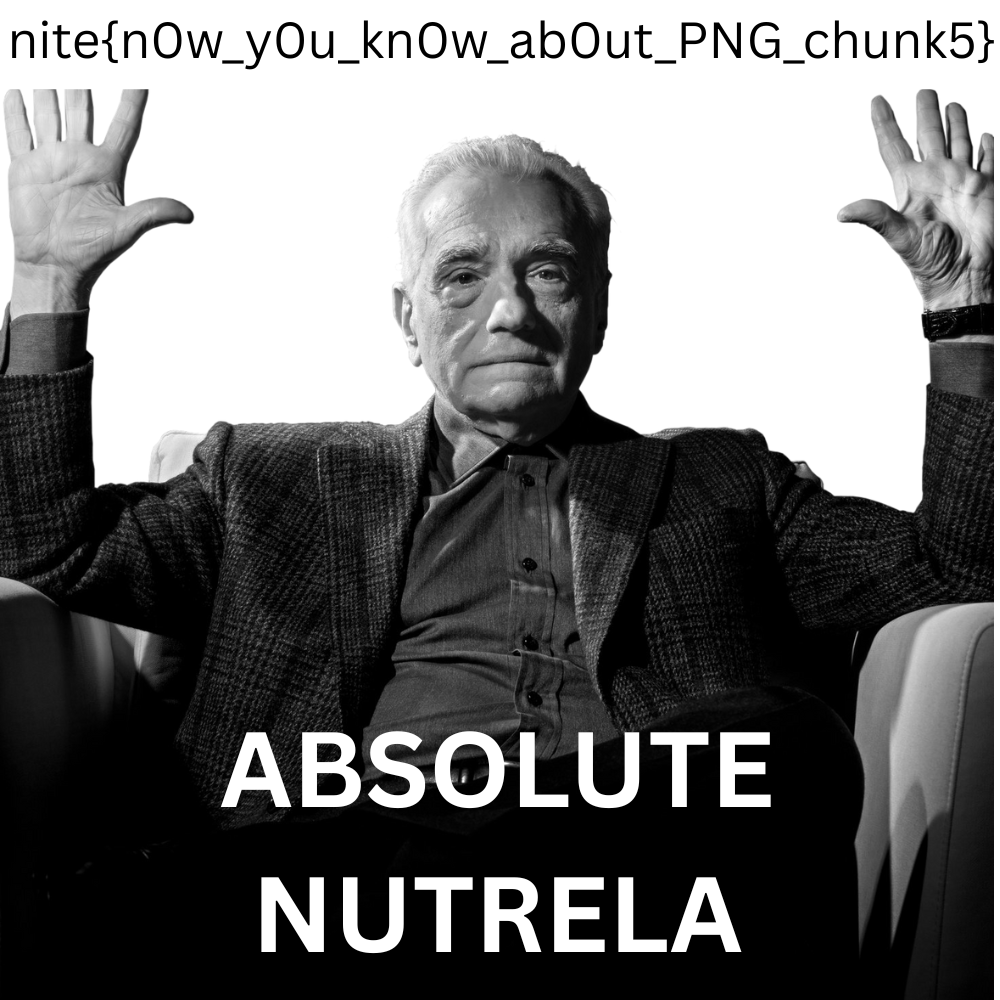
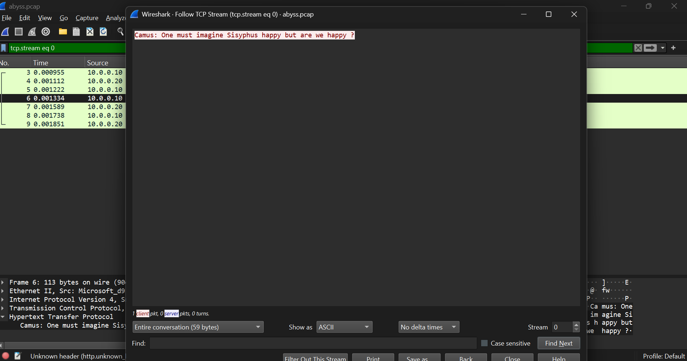
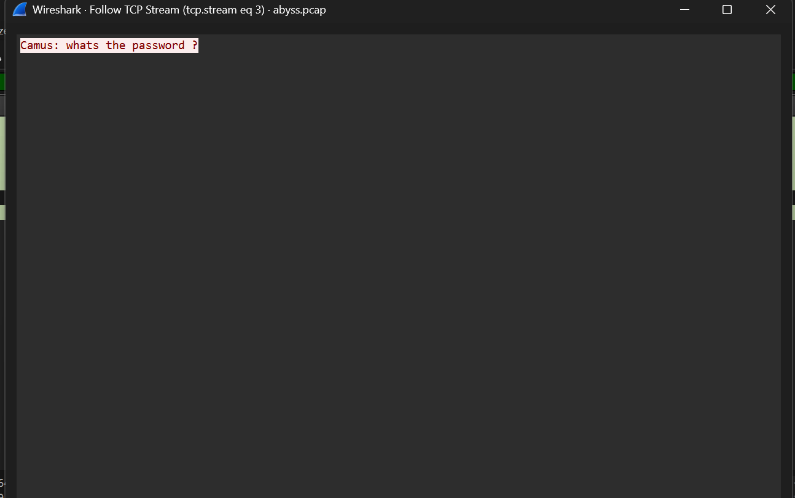
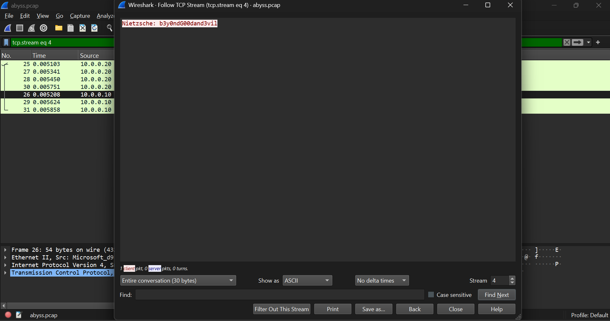
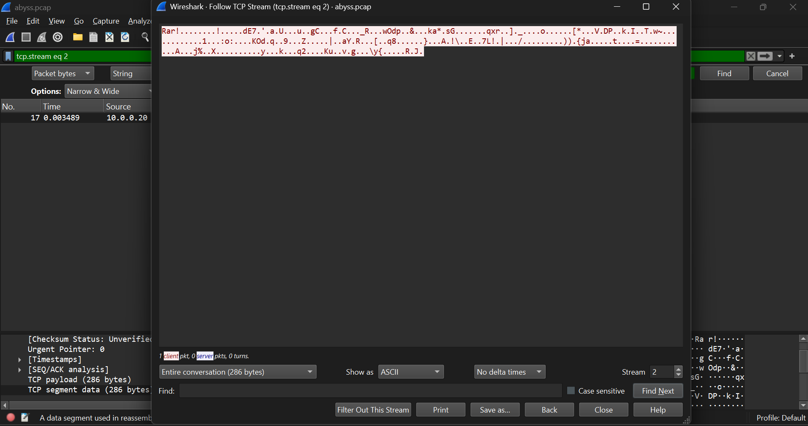
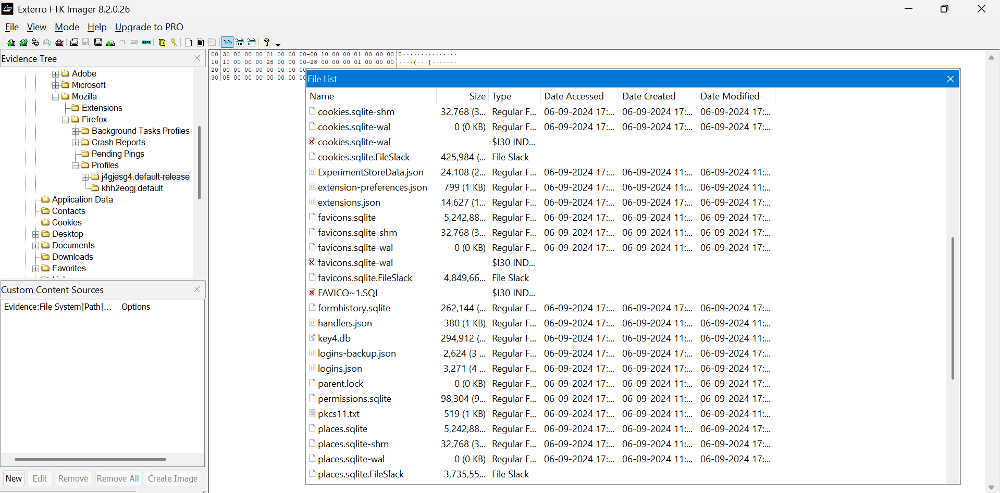
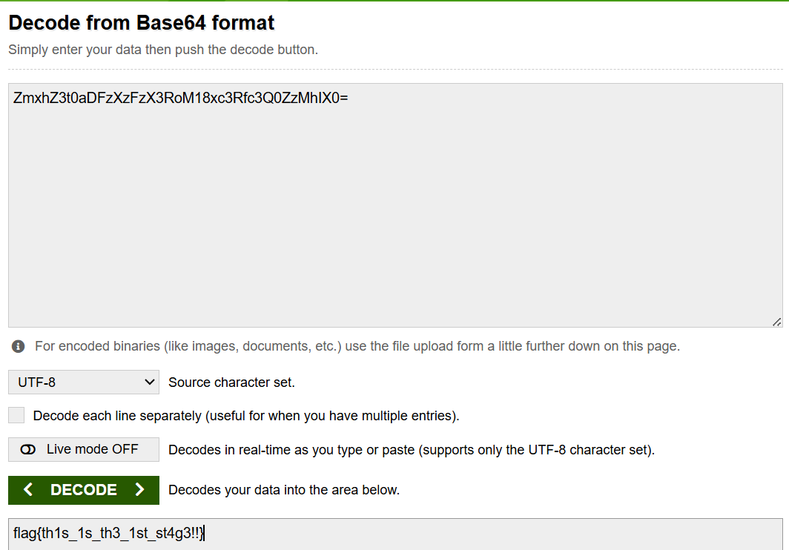
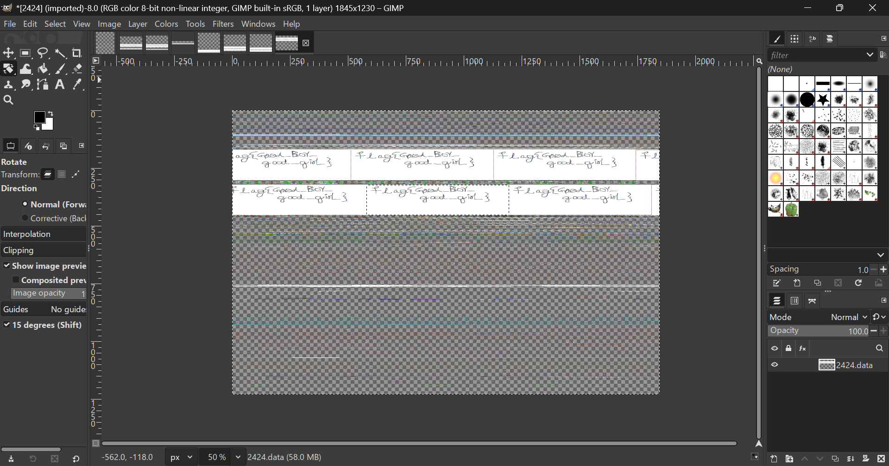
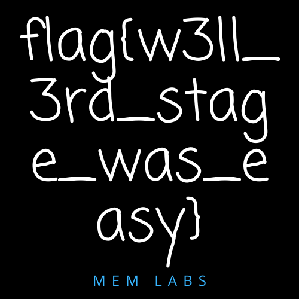

# HIDE and SEEK
Sakamoto’s at it again with a game of hide and seek, but this time, it’s not with Shin or his daughter. An old friend hid some secret data in this image. Can you find it before the others do?

Hint:
Even in retirement, Sakamoto never loses at hide and seek. Maybe stegseek can help you keep up.

## Flag 
```bash
nite{h1d3_4nd_s33k_but_w1th_st3g_sdfu9s8}
```

## Solve
* First I downloaded stegseek from https://github.com/RickdeJager/stegseek?tab=readme-ov-file#whale-docker , then I also downloaded the rockyou.txt file into my directory since it was the top recommended one in the git page by downloading the compressed file and then extracting its file content
* I ran stegseek on (-sf argument)sakamoto.jpg with respect to (-wf argument)the word file rockyou.txt and then obtained the passphrase, with its original filename and then it automatically extracted to the sakamoto.jpg.out which contains the file contents. 

```bash
snmvarun@DESKTOP-16J7ALL:/mnt/d/Cryptonite/Custom$ stegseek -sf sakamoto.jpg -wl rockyou.txt
StegSeek 0.6 - https://github.com/RickdeJager/StegSeek

[i] Found passphrase: "iloveyou1"
[i] Original filename: "flag.txt".
[i] Extracting to "sakamoto.jpg.out".

snmvarun@DESKTOP-16J7ALL:/mnt/d/Cryptonite/Custom$ cat sakamoto.jpg.out
nite{h1d3_4nd_s33k_but_w1th_st3g_sdfu9s8}
```

# Concepts Learnt
* I learned to use stegseek 
* Learnt what are wordlists and specifically rockyou.txt(It containts 14 million+ well known passwords)

# Sources
* https://github.com/RickdeJager/stegseek?tab=readme-ov-file#whale-docker

# Nutrela Chunks
One of my favorite foods is soya chunks. But as I was enjoying some Nutrela today, I noticed a few chunks weren’t quite right. Seems like something’s off with their structure. Could you help me fix these broken chunks so I can enjoy my meal again?

# Flag
```bash
nite{n0w_y0u_kn0w_ab0ut_PNG_chunk5}
```

## Solve
* The file couldn't be opened normally.
* I opened the file in HxD editor
* As the subject of the challenge suggested, I researched about png signatures, chunk headers and more
* I learned that a valid PNG image must contain an IHDR chunk, one or more IDAT chunks, and an IEND chunk, with IHDR at the start of the file and IEND at the end of the file, I pressed ctrl+f to search for these chunks in the Decoded text searcher, to find none, but after some observation, the headers were present but in the swapped letter case, I converted "ihdr" to IDHR in the decoded text and the same with idat and iend chunks.
* Saved the file to get the fixed png file showing: 

  

## Concepts Learnt
* The hexdump of a png file and what are its chunks

## Sources
* https://www.libpng.org/pub/png/spec/1.2/PNG-Chunks.html

# RAR of the Abyss
Two philosophers peer into the networked abyss and swap a secret. Use the secret to decrypt the Abyss’ RAwR and pull your flag from the void.

## Flag
```bash
nite{thus_sp0k3_th3_n3tw0rk_f0r3ns1cs_4n4lyst}
```

## Solve
* First the .pcap file gave a clue that I should load the file in wireshark and I started looking for clues
* Then after going through a the TCP streams in ASCII that have the PSH(push) request, I understood that the two philosophers are Camus and Nietzsche
* I went through the conversation a little and extracted the password as "b3y0ndG00dand3vil"
* Then I found another decoded TCP stream that showed content starting with Rar! which indicated a zipped file






* So I changed it to show as RAW content and then saved the file

```bash
snmvarun@DESKTOP-16J7ALL:/mnt/d/Cryptonite/Custom$ unrar x abyss.rar

UNRAR 7.00 freeware      Copyright (c) 1993-2024 Alexander Roshal

Enter password (will not be echoed) for abyss.rar:


Extracting from abyss.rar

Extracting  flag.txt                                                  OK
All OK
snmvarun@DESKTOP-16J7ALL:/mnt/d/Cryptonite/Custom$ ls
Digital_Forensics.md  abyss.rar  image-1.png  image-3.png  nutrela.png
abyss.pcap            flag.txt   image-2.png  image.png    nutrela.png.bak
snmvarun@DESKTOP-16J7ALL:/mnt/d/Cryptonite/Custom$ cat flag.txt
nite{thus_sp0k3_th3_n3tw0rk_f0r3ns1cs_4n4lyst}
```

* Then I unzipped the file and obtained the flag file.
* Catted the flag to get the flag content.

## Content Learnt 
* To analyse a .pcap file using Wireshark.

# NineTails
Looks like I got a little too clever and hid the flag as a password in Firefox, tucked away like one of NineTails’ many tails. Recover the "logins" and the "key4" and let it guide you to the flag.

Hint: I named my Ninetails "j4gjesg4", quite a peculiar name isn't it?

## Flag

```bash
GCTF{m0zarella_f1ref0x_p4ssw0rd}
```

## Solve 
* First I opened the file using WINRAR to get a .ad1 file, now to open a .ad1 file and inspect it I downloaded FTK Imager. 
* I Opened the file in the FTK Imager and looked for something according to the hints given in the challenge desc.
* I found a folder in the the path "GIC2024\AppData\Roaming\Mozilla\Firefox\Profiles\j4gjesg4.default-release" and found the login.json and key4.db inthe file and exported all the entire folder onto my laptop folder named - "Firefox_dump".


* Then I understood that login.json had username and passwords that were encrypted and the key4.db is the key to decrypt.
* I ran a decryption algorithm by installing firefox_decrypt on github and then I decrypted it   

```bash
# I copied the contents of "Firefox_dump" into a directory called /ninetails_temp in the home directory 
snmvarun@DESKTOP-16J7ALL:~/firefox_decrypt$ python3 firefox_decrypt.py ~/ninetails_temp
2025-12-05 14:02:26,884 - WARNING - profile.ini not found in /home/snmvarun/ninetails_temp
2025-12-05 14:02:26,884 - WARNING - Continuing and assuming '/home/snmvarun/ninetails_temp' is a profile location

Website:   https://www.rehack.xyz
Username: 'warlocksmurf'
Password: 'GCTF{m0zarella'

Website:   https://ctftime.org
Username: 'ilovecheese'
Password: 'CHEEEEEEEEEEEEEEEEEEEEEEEEEESE'

Website:   https://www.reddit.com
Username: 'bluelobster'
Password: '_f1ref0x_'

Website:   https://www.facebook.com
Username: 'flag'
Password: 'SIKE'

Website:   https://warlocksmurf.github.io
Username: 'Man I Love Forensics'
Password: 'p4ssw0rd}'
```

* Compiling the relevent parts of the passwords(discarding the 'spam' looking passwords like CHEEESE and SIKE) I got the flag.

## Concepts Learnt
* Comprehending and inspecting .ad1 files
* What are login.json and key4.db 
* How to use FTK Imager 
* How to decrypt the password and usernames using the key

# Sources 
* [Exterro FTK Imager](https://www.exterro.com/ftk-product-downloads/ftk-imager-pro-8-2-0-26)
* [Firefox - Rescuing saved passwords](https://dev.to/higordiego/cracking-firefox-encryption-and-rescuing-saved-passwords-pfl)

## Notes
I kept on copying only the login.json and key4.db files and wasted a lot of time and effort trying to crack them when I needed to copy the whole folder. 

# Re:Draw 
Her screen went black and a strange command window flickered to life, lines of text flashed across before everything went silent. Moments later, the system crashed. By sheer luck, we recovered a memory dump. 

Note: There are three stages to this challenge and you will find three flags. 

What we know: just before the crash, a black command window flickered across the screen, something in its output might still be visible if you dig through memory. She was drawing when it happened, and remnants of a painting program linger, which could reveal more if inspected in the right way. Finally, a mysterious archive hides deeper in memory, likely holding the last piece of her work. 

Hint: Learn up on volatility 2 and its various plugins and what they are used for.

## Flag

```bash
flag{th1s_1s_th3_1st_st4g3!!}
flag{Good_Boy_good_girl}
flag{w3ll_3rd_stage_was_easy}
```

## Solve
### Stage 1 - cmd
* I used WINRAR to extract the files in the compressed file to find a .raw file, a memory dump.
* After downloading python2 and volatility2, I studied its plugins and functions as instructed in the challenge desc.
* First I ran imageinfo plugin to go through and determine the OS profile in the suggested ones, best guess was the first one - Win7SP1x64   
* Using this profile for further analysis, I used pslist wrt to the profile to output processes active in the system's memory at the time of a memory capture.
* I found cmd.exe and mspaint.exe relevent to the challenge
* Then I used the consoles plugin which retrieves the commands typed and their output and redirected it into a txt file consoles

```bash
snmvarun@DESKTOP-16J7ALL:~/volatility$ python vol.py -f /mnt/d/Cryptonite/Custom/MemoryDump_Lab1.raw imageinfo
Volatility Foundation Volatility Framework 2.6.1
*** Failed to import volatility.plugins.malware.apihooks (NameError: name 'distorm3' is not defined)
*** Failed to import volatility.plugins.malware.threads (NameError: name 'distorm3' is not defined)
*** Failed to import volatility.plugins.mac.apihooks_kernel (ImportError: No module named distorm3)
*** Failed to import volatility.plugins.mac.check_syscall_shadow (ImportError: No module named distorm3)
*** Failed to import volatility.plugins.ssdt (NameError: name 'distorm3' is not defined)
*** Failed to import volatility.plugins.mac.apihooks (ImportError: No module named distorm3)
INFO    : volatility.debug    : Determining profile based on KDBG search...
          Suggested Profile(s) : Win7SP1x64, Win7SP0x64, Win2008R2SP0x64, Win2008R2SP1x64_24000, Win2008R2SP1x64_23418, Win2008R2SP1x64, Win7SP1x64_24000, Win7SP1x64_23418
                     AS Layer1 : WindowsAMD64PagedMemory (Kernel AS)
                     AS Layer2 : FileAddressSpace (/mnt/d/Cryptonite/Custom/MemoryDump_Lab1.raw)
                      PAE type : No PAE
                           DTB : 0x187000L
                          KDBG : 0xf800028100a0L
          Number of Processors : 1
     Image Type (Service Pack) : 1
                KPCR for CPU 0 : 0xfffff80002811d00L
             KUSER_SHARED_DATA : 0xfffff78000000000L
           Image date and time : 2019-12-11 14:38:00 UTC+0000
     Image local date and time : 2019-12-11 20:08:00 +0530
snmvarun@DESKTOP-16J7ALL:~/volatility$ python vol.py -f /mnt/d/Cryptonite/Custom/MemoryDump_Lab1.raw --profile=Win7SP1x64 pslist
Volatility Foundation Volatility Framework 2.6.1
*** Failed to import volatility.plugins.malware.apihooks (NameError: name 'distorm3' is not defined)
*** Failed to import volatility.plugins.malware.threads (NameError: name 'distorm3' is not defined)
*** Failed to import volatility.plugins.mac.apihooks_kernel (ImportError: No module named distorm3)
*** Failed to import volatility.plugins.mac.check_syscall_shadow (ImportError: No module named distorm3)
*** Failed to import volatility.plugins.ssdt (NameError: name 'distorm3' is not defined)
*** Failed to import volatility.plugins.mac.apihooks (ImportError: No module named distorm3)
Offset(V)          Name                    PID   PPID   Thds     Hnds   Sess  Wow64 Start                          Exit              
------------------ -------------------- ------ ------ ------ -------- ------ ------ ------------------------------ ------------------------------
0xfffffa8000ca0040 System                    4      0     80      570 ------      0 2019-12-11 13:41:25 UTC+0000                     
0xfffffa800148f040 smss.exe                248      4      3       37 ------      0 2019-12-11 13:41:25 UTC+0000                     
0xfffffa800154f740 csrss.exe               320    312      9      457      0      0 2019-12-11 13:41:32 UTC+0000                     
0xfffffa8000ca81e0 csrss.exe               368    360      7      199      1      0 2019-12-11 13:41:33 UTC+0000                     
0xfffffa8001c45060 psxss.exe               376    248     18      786      0      0 2019-12-11 13:41:33 UTC+0000                     
0xfffffa8001c5f060 winlogon.exe            416    360      4      118      1      0 2019-12-11 13:41:34 UTC+0000                     
0xfffffa8001c5f630 wininit.exe             424    312      3       75      0      0 2019-12-11 13:41:34 UTC+0000                     
0xfffffa8001c98530 services.exe            484    424     13      219      0      0 2019-12-11 13:41:35 UTC+0000                     
0xfffffa8001ca0580 lsass.exe               492    424      9      764      0      0 2019-12-11 13:41:35 UTC+0000                     
0xfffffa8001ca4b30 lsm.exe                 500    424     11      185      0      0 2019-12-11 13:41:35 UTC+0000                     
0xfffffa8001cf4b30 svchost.exe             588    484     11      358      0      0 2019-12-11 13:41:39 UTC+0000                     
0xfffffa8001d327c0 VBoxService.ex          652    484     13      137      0      0 2019-12-11 13:41:40 UTC+0000                     
0xfffffa8001d49b30 svchost.exe             720    484      8      279      0      0 2019-12-11 13:41:41 UTC+0000                     
0xfffffa8001d8c420 svchost.exe             816    484     23      569      0      0 2019-12-11 13:41:42 UTC+0000                     
0xfffffa8001da5b30 svchost.exe             852    484     28      542      0      0 2019-12-11 13:41:43 UTC+0000                     
0xfffffa8001da96c0 svchost.exe             876    484     32      941      0      0 2019-12-11 13:41:43 UTC+0000                     
0xfffffa8001e1bb30 svchost.exe             472    484     19      476      0      0 2019-12-11 13:41:47 UTC+0000                     
0xfffffa8001e50b30 svchost.exe            1044    484     14      366      0      0 2019-12-11 13:41:48 UTC+0000                     
0xfffffa8001eba230 spoolsv.exe            1208    484     13      282      0      0 2019-12-11 13:41:51 UTC+0000                     
0xfffffa8001eda060 svchost.exe            1248    484     19      313      0      0 2019-12-11 13:41:52 UTC+0000                     
0xfffffa8001f58890 svchost.exe            1372    484     22      295      0      0 2019-12-11 13:41:54 UTC+0000                     
0xfffffa8001f91b30 TCPSVCS.EXE            1416    484      4       97      0      0 2019-12-11 13:41:55 UTC+0000                     
0xfffffa8000d3c400 sppsvc.exe             1508    484      4      141      0      0 2019-12-11 14:16:06 UTC+0000                     
0xfffffa8001c38580 svchost.exe             948    484     13      322      0      0 2019-12-11 14:16:07 UTC+0000                     
0xfffffa8002170630 wmpnetwk.exe           1856    484     16      451      0      0 2019-12-11 14:16:08 UTC+0000                     
0xfffffa8001d376f0 SearchIndexer.          480    484     14      701      0      0 2019-12-11 14:16:09 UTC+0000                     
0xfffffa8001eb47f0 taskhost.exe            296    484      8      151      1      0 2019-12-11 14:32:24 UTC+0000                     
0xfffffa8001dfa910 dwm.exe                1988    852      5       72      1      0 2019-12-11 14:32:25 UTC+0000                     
0xfffffa8002046960 explorer.exe            604   2016     33      927      1      0 2019-12-11 14:32:25 UTC+0000                     
0xfffffa80021c75d0 VBoxTray.exe           1844    604     11      140      1      0 2019-12-11 14:32:35 UTC+0000                     
0xfffffa80021da060 audiodg.exe            2064    816      6      131      0      0 2019-12-11 14:32:37 UTC+0000                     
0xfffffa80022199e0 svchost.exe            2368    484      9      365      0      0 2019-12-11 14:32:51 UTC+0000                     
0xfffffa8002222780 cmd.exe                1984    604      1       21      1      0 2019-12-11 14:34:54 UTC+0000                     
0xfffffa8002227140 conhost.exe            2692    368      2       50      1      0 2019-12-11 14:34:54 UTC+0000                     
0xfffffa80022bab30 mspaint.exe            2424    604      6      128      1      0 2019-12-11 14:35:14 UTC+0000                     
0xfffffa8000eac770 svchost.exe            2660    484      6      100      0      0 2019-12-11 14:35:14 UTC+0000                     
0xfffffa8001e68060 csrss.exe              2760   2680      7      172      2      0 2019-12-11 14:37:05 UTC+0000                     
0xfffffa8000ecbb30 winlogon.exe           2808   2680      4      119      2      0 2019-12-11 14:37:05 UTC+0000                     
0xfffffa8000f3aab0 taskhost.exe           2908    484      9      158      2      0 2019-12-11 14:37:13 UTC+0000                     
0xfffffa8000f4db30 dwm.exe                3004    852      5       72      2      0 2019-12-11 14:37:14 UTC+0000                     
0xfffffa8000f4c670 explorer.exe           2504   3000     34      825      2      0 2019-12-11 14:37:14 UTC+0000                     
0xfffffa8000f9a4e0 VBoxTray.exe           2304   2504     14      144      2      0 2019-12-11 14:37:14 UTC+0000                     
0xfffffa8000fff630 SearchProtocol         2524    480      7      226      2      0 2019-12-11 14:37:21 UTC+0000                     
0xfffffa8000ecea60 SearchFilterHo         1720    480      5       90      0      0 2019-12-11 14:37:21 UTC+0000                     
0xfffffa8001010b30 WinRAR.exe             1512   2504      6      207      2      0 2019-12-11 14:37:23 UTC+0000                     
0xfffffa8001020b30 SearchProtocol         2868    480      8      279      0      0 2019-12-11 14:37:23 UTC+0000                     
0xfffffa8001048060 DumpIt.exe              796    604      2       45      1      1 2019-12-11 14:37:54 UTC+0000                     
0xfffffa800104a780 conhost.exe            2260    368      2       50      1      0 2019-12-11 14:37:54 UTC+0000                     
snmvarun@DESKTOP-16J7ALL:~/volatility$ python vol.py -f /mnt/d/Cryptonite/Custom/MemoryDump_Lab1.raw --profile=Win7SP1x64 consoles > consoles.txt
Volatility Foundation Volatility Framework 2.6.1
snmvarun@DESKTOP-16J7ALL:~/volatility$ cat consoles.txt
*** Failed to import volatility.plugins.malware.apihooks (NameError: name 'distorm3' is not defined)
*** Failed to import volatility.plugins.malware.threads (NameError: name 'distorm3' is not defined)
*** Failed to import volatility.plugins.mac.apihooks_kernel (ImportError: No module named distorm3)
*** Failed to import volatility.plugins.mac.check_syscall_shadow (ImportError: No module named distorm3)
*** Failed to import volatility.plugins.ssdt (NameError: name 'distorm3' is not defined)
*** Failed to import volatility.plugins.mac.apihooks (ImportError: No module named distorm3)
**************************************************
ConsoleProcess: conhost.exe Pid: 2692
Console: 0xff756200 CommandHistorySize: 50
HistoryBufferCount: 1 HistoryBufferMax: 4
OriginalTitle: %SystemRoot%\system32\cmd.exe
Title: C:\Windows\system32\cmd.exe - St4G3$1
AttachedProcess: cmd.exe Pid: 1984 Handle: 0x60
----
CommandHistory: 0x1fe9c0 Application: cmd.exe Flags: Allocated, Reset
CommandCount: 1 LastAdded: 0 LastDisplayed: 0
FirstCommand: 0 CommandCountMax: 50
ProcessHandle: 0x60
Cmd #0 at 0x1de3c0: St4G3$1
----
Screen 0x1e0f70 X:80 Y:300
Dump:
Microsoft Windows [Version 6.1.7601]
Copyright (c) 2009 Microsoft Corporation.  All rights reserved.

C:\Users\SmartNet>St4G3$1
ZmxhZ3t0aDFzXzFzX3RoM18xc3Rfc3Q0ZzMhIX0=
Press any key to continue . . .
**************************************************
ConsoleProcess: conhost.exe Pid: 2260
Console: 0xff756200 CommandHistorySize: 50
HistoryBufferCount: 1 HistoryBufferMax: 4
OriginalTitle: C:\Users\SmartNet\Downloads\DumpIt\DumpIt.exe
Title: C:\Users\SmartNet\Downloads\DumpIt\DumpIt.exe
AttachedProcess: DumpIt.exe Pid: 796 Handle: 0x60
----
CommandHistory: 0x38ea90 Application: DumpIt.exe Flags: Allocated
CommandCount: 0 LastAdded: -1 LastDisplayed: -1
FirstCommand: 0 CommandCountMax: 50
ProcessHandle: 0x60
----
Screen 0x371050 X:80 Y:300
Dump:
  DumpIt - v1.3.2.20110401 - One click memory memory dumper
  Copyright (c) 2007 - 2011, Matthieu Suiche <http://www.msuiche.net>
  Copyright (c) 2010 - 2011, MoonSols <http://www.moonsols.com>


    Address space size:        1073676288 bytes (   1023 Mb)
    Free space size:          24185389056 bytes (  23064 Mb)

    * Destination = \??\C:\Users\SmartNet\Downloads\DumpIt\SMARTNET-PC-20191211-
143755.raw

    --> Are you sure you want to continue? [y/n] y
    + Processing...
snmvarun@DESKTOP-16J7ALL:~/volatility$
```

* I catted the information in consoles.txt to find the info ```ZmxhZ3t0aDFzXzFzX3RoM18xc3Rfc3Q0ZzMhIX0=``` which is very likely to be a base64 encoded code(Because of the = sign at the end which implies padding).

* So I used an online decoder to decode to get the first flag


### Stage 2 - mspaint
* First I used memdump plugin with the PID of mspaint.exe which makes a 2424.dmp file which has that process' memory dump.
* I convert that file into .data easily to run it in GIMP
* I open it with raw image data.
* I analyse using trial and error to find the best suiting pixel format, height, offset and width
* I arrived at height = 1230 which was optimal for image alignment but I struggling with the width
* After analysing in HxD, a repeating ```FF FF FF FF``` was seen which was indicating towards RGBA type of pixel format at byte 276.
* Then I also notice that 8-bit RGBA made writing clearer than 32-bit which had more pixelated colours making it harder to make out what was written
* Then finally playing around with the width gave the image clear image finally at width = 1845 in inverse
* I then simply flipped it horizontally then vertically to get the flag written out.



### Stage 3 - winRAR
* The memory dump also consisted of WinRAR.exe which probably contained a compressed archive. 
* After searching and grepping I found Important.rar file and dumped it using dumpfiles plugin.
* After that I found the NTLM Hash(4th field of the hashdump of the profile) and changed the character all to uppercase and then decompressed the contents of Important.rar file to enter the NTLM Hash as the password to find the flag.



## Notes
* = at the end of a code implies padding which indicates Base64 code, aswell as the number of characters to be divisible by 4

## Sources 
