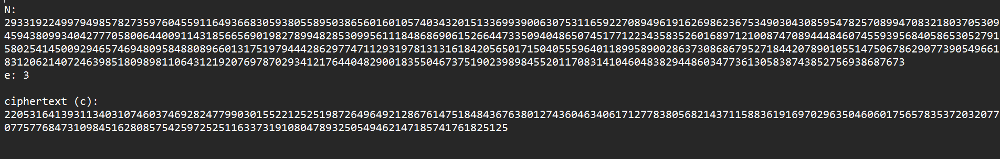
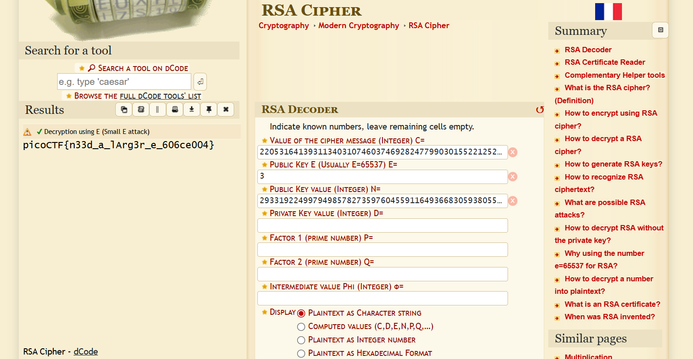

# 1. miniRSA

> Put in the challenge's description here

## Solution:

What I noticed first was that the value of 'e' and value of 'N' was given in the file aswell as the encrypted text. So I ran the encrypted text onto a RSA decoder online and got the flag.


## Flag:

```
picoCTF{n33d_a_lArg3r_e_606ce004}
```

## Concepts learnt:

- How to use an RSA decoder and how they work.

## Notes:
- none

## Resources:

- [RSA Decoder](https://www.dcode.fr/rsa-cipher)


