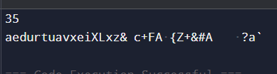
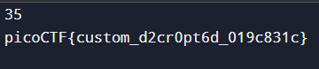

# 1. miniRSA

Let's decrypt this: ciphertext? Something seems a bit small.

## Solution:

What I noticed first was that the value of 'e' and value of 'N' was given in the file aswell as the encrypted text. So I ran the encrypted text onto a RSA decoder online and got the flag.


## Flag:

```
picoCTF{n33d_a_lArg3r_e_606ce004}
```

## Concepts learnt:

- How to use an RSA decoder and how they work.

## Notes:
- none

## Resources:

- [RSA Decoder](https://www.dcode.fr/rsa-cipher)

# 2. Custom Encryption

Can you get sense of this code file and write the function that will decode the given encrypted file content. Find the encrypted file here flag_info and code file might be good to analyze and get the flag.

## Solution:
```python
def generator(g, x, p):
    return pow(g, x) % p        #function made to generate a key(modular exponentiation, a key component in DH key exchange algorithm)

def dynamic_xor_encrypt(plaintext, text_key): 
    cipher_text = ""                                 
    key_length = len(text_key)
    k = ""

    for i, char in enumerate(plaintext[::-1]):
        key_char = text_key[i % key_length]
        k += key_char
        encrypted_char = chr(ord(char) ^ ord(key_char)) #XOR operation
        cipher_text += encrypted_char #result
        print(k)
    return cipher_text      #function based on XOR cipher to encrypt/decrypt

p = 97
g = 31
a = 88
b = 26 

cipher = [97965, 185045, 740180, 946995, 1012305, 21770, 827260, 751065, 718410, 457170, 0, 903455, 228585, 54425, 740180, 0, 239470, 936110, 10885, 674870, 261240, 293895, 65310, 65310, 185045, 65310, 283010, 555135, 348320, 533365, 283010, 76195, 130620, 185045]


v = generator(g, b, p)
key = generator(v, a, p)

print(key)

decipher = ""

for c in cipher:
    decipher += chr(c // 311 // key) #Reversing the first layer of encryption

print(dynamic_xor_encrypt(decipher, "picoCTF{")) #Reversing the second layer(XOR encryption)
```


First I ran the decryption program putting "picoCTF{" as the string to second decryption, which would give me the correct key "aedurtu" as the first 7 characters(due to the key length) of the string, so then I copy it and place it in place of "picoCTF{" and then run it to get the correct flag. 



## Flag:

```
picoCTF{custom_d2cr0pt6d_019c831c}
```

## Concepts learnt:

- Comprehending a decryption algorithm

## Notes:
- The inverse operation of XOR cipher is XOR itself
- Only 7 characters of the first output because decipher string was originally encrypted using a 7 character key  

## Resources:

- [geeks for geeks - decryption algorithm basics](https://www.geeksforgeeks.org/computer-networks/basics-of-cryptographic-algorithms/)
- [XOR Cipher Information](https://www.geeksforgeeks.org/dsa/xor-cipher/)


