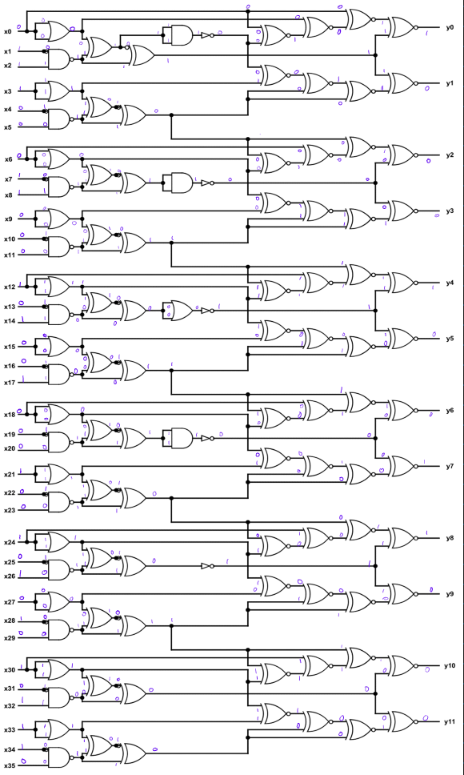
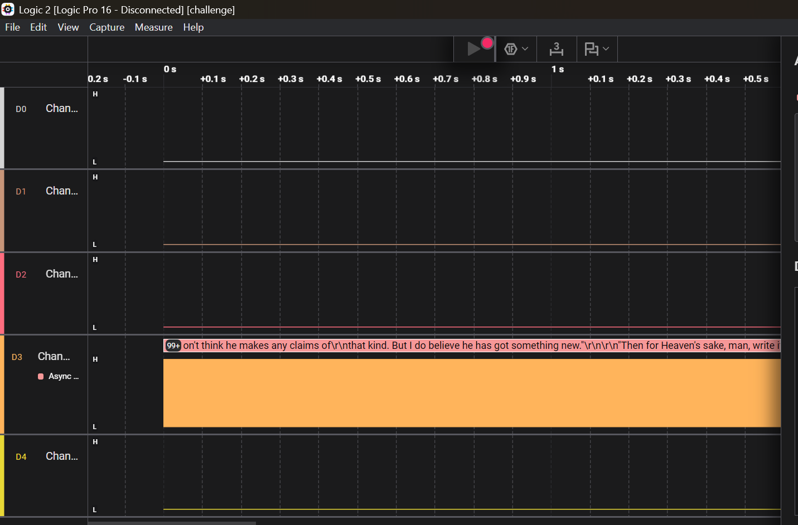
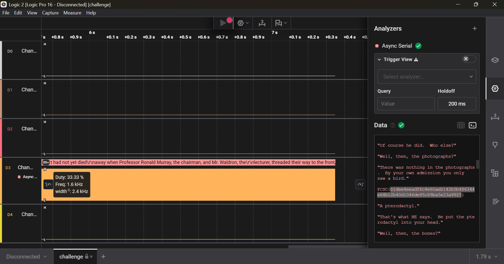

# 1. IQ Test
let your input x = 30478191278.

wrap your answer with nite{ } for the flag.

As an example, entering x = 34359738368 gives (y0, ..., y11), so the flag would be nite{010000000011}.

## Solution:
```bash
snmvarun@DESKTOP-16J7ALL:/mnt/d/Cryptonite/PicoCTF/Hardware$ file iqtest.png
iqtest.png: PNG image data, 1225 x 2176, 8-bit colormap, non-interlaced
```
My first thought was to check whats up with the file and its metadeta but found nothing interesting and scratched that idea, since the flag contents were similar to binary, I thought to check its input in binary which gave a 36 bit binary number where would each bit cooresponds to the x0,..x35, that would be put into the logic circuit of the image to get the output binary. Doing it similar to the example, when I take x=30478191278, its binary equivalent is 011100011000101001000100101010101110. Cooresponding each of the output and concatting them, the 12 bit binary number is 100010011000, which are the flag contents.


## Flag:
```
nite{100010011000}
```

## Concepts learnt:

- Navigating through circuit diagrams
- Data Representation 

## Notes:

- Steganography was not an approach to take.

## Resources:

- none

# 2. i_like_logic

i like logic and i like files, apparently, they have something in common, what should my next step be.


## Solution:
First I researched on what a .sal file is to understand the basics of sal file and downloaded saleae logic 2, now then I opened the sal file in software and realised that D3 channel was the only channel that was having data or was responsive, all others were flat, this eliminated the possibilities of SPI and I2C to confirm that we should use Async Serial Analyser. 


I set the channel to D3 for the Async Serial analyser and ran it, it showed some form of data in hexadecimal, so I changed it to ASCII format and got a big string in the terminal, in the middle of the terminal was the flag present


## Flag:

```
FCSC{b1dee4eeadf6c4e60aeb142b0b486344e64b12b40d1046de95c89ba5e23a9925}
```

## Concepts learnt:

- What are .sal files and how to use saleae logic 2 to analyse the files.
- What are the different types of analysers.

## Notes:

- none

## Resources:

- [Saleae Logic 2 Tutorial](https://youtu.be/Ak9R4yxQPhs?si=L8o_v62FXL66I5Oh)
- [What is SPI, I2C, UART](https://www.totalphase.com/blog/2021/12/i2c-vs-spi-vs-uart-introduction-and-comparison-similarities-differences/?srsltid=AfmBOorDPu4PACMYCJ-qgBSezVzkEISjbAtdJWbqEexsgKWSsFEGIMw8)

# 3. bare-metal-alchemist

my friend recommended me this anime but i think i've heard a wrong name.

## Solution:
First I analysed the firmware.elf command to conclude that it is a ELF executable file in AVR 8-bit format(The same format in microcontrollers that are usually used in embedded systems). Now looking for a decoder and decompiler I found ghidra and radare2. Now I tried working on ghidra first but didn't get much progress done, so I resorted to radare2 which was a better interface to use on WSL. After understanding a few commands using tutorials, first I ran "s main" to change pointer to the main function, then I ran the pdf command to print out disassembly of the function. Then after analysing the disassembly code, I understood that the code is practically running XOR operation on the data stored in the program memory and constant stored in a register. Going up the chain of program of the register assignments, I arrived at the constant to be "0xA5", also took a calculated guess "0x68" is the ciphertext(since it was a bit random). Then, I used the command "s 0x68" to move pointer to that memory address. Then used px 100 to print the first 100 bytes of what is stored in its memory locations, printing the encrypted content and key. I ran it through an online XOR decrypter to get the final flag

```bash
snmvarun@DESKTOP-16J7ALL:/mnt/d/Cryptonite/PicoCTF/Hardware$ r2 -A ./firmware.elf
[Warning: set your favourite calling convention in `e anal.cc=?`
[x] Analyze all flags starting with sym. and entry0 (aa)
[Invalid address from 0x00000288
[x] Analyze function calls (aac)
[x] Analyze len bytes of instructions for references (aar)
[x] Finding and parsing C++ vtables (avrr)
[x] Finding xrefs in noncode section (e anal.in=io.maps.x)
[x] Analyze value pointers (aav)
[x] Value from 0x00000000 to 0x000002e4 (aav)
[x] 0x00000000-0x000002e4 in 0x0-0x2e4 (aav)
[x] Emulate functions to find computed references (aaef)
[x] Type matching analysis for all functions (aaft)
[x] Propagate noreturn information (aanr)
[x] Integrate dwarf function information.
[x] Use -AA or aaaa to perform additional experimental analysis.
[0x00000000]> s main
[0x00000176]> pdf
            ; CALL XREF from entry0 @ 0xc8
┌ 362: int main (int argc, char **argv, char **envp);
│           0x00000176      cf93           push r28
│           0x00000178      df93           push r29
│           0x0000017a      00d0           rcall 0x17c                 ; int main(int argc, char **argv, char **envp)
│           ; CALL XREF from main @ 0x17a
│           0x0000017c      cdb7           in r28, 0x3d                ; IO SPL: Stack lower bits SP0-SP7
│           0x0000017e      deb7           in r29, 0x3e                ; IO SPH: Stack higher bits SP8-SP10
│           0x00000180      7894           sei
│           0x00000182      84b5           in r24, 0x24                ; IO TCNT2: Timer/Counter2 (8 bits).
│           0x00000184      8260           ori r24, 0x02
│           0x00000186      84bd           out 0x24, r24               ; IO TCNT2: Timer/Counter2 (8 bits).
│           0x00000188      84b5           in r24, 0x24                ; IO TCNT2: Timer/Counter2 (8 bits).
│           0x0000018a      8160           ori r24, 0x01
│           0x0000018c      84bd           out 0x24, r24               ; IO TCNT2: Timer/Counter2 (8 bits).
│           0x0000018e      85b5           in r24, 0x25                ; IO TCCR2: Timer/Counter2 Control Register (8 bits).
│           0x00000190      8260           ori r24, 0x02
│           0x00000192      85bd           out 0x25, r24               ; IO TCCR2: Timer/Counter2 Control Register (8 bits).
│           0x00000194      85b5           in r24, 0x25                ; IO TCCR2: Timer/Counter2 Control Register (8 bits).
│           0x00000196      8160           ori r24, 0x01
│           0x00000198      85bd           out 0x25, r24               ; IO TCCR2: Timer/Counter2 Control Register (8 bits).
│           0x0000019a      80916e00       lds r24, 0x6e
│           0x0000019e      8160           ori r24, 0x01
│           0x000001a0      80936e00       sts 0x6e, r24
│           0x000001a4      10928100       sts 0x81, r1
│           0x000001a8      80918100       lds r24, 0x81
│           0x000001ac      8260           ori r24, 0x02
│           0x000001ae      80938100       sts 0x81, r24
│           0x000001b2      80918100       lds r24, 0x81
│           0x000001b6      8160           ori r24, 0x01
│           0x000001b8      80938100       sts 0x81, r24
│           0x000001bc      80918000       lds r24, 0x80               ; sph
│           0x000001c0      8160           ori r24, 0x01
│           0x000001c2      80938000       sts 0x80, r24               ; sph
│           0x000001c6      8091b100       lds r24, 0xb1
│           0x000001ca      8460           ori r24, 0x04
│           0x000001cc      8093b100       sts 0xb1, r24
│           0x000001d0      8091b000       lds r24, 0xb0
│           0x000001d4      8160           ori r24, 0x01
│           0x000001d6      8093b000       sts 0xb0, r24
│           0x000001da      80917a00       lds r24, 0x7a
│           0x000001de      8460           ori r24, 0x04
│           0x000001e0      80937a00       sts 0x7a, r24
│           0x000001e4      80917a00       lds r24, 0x7a
│           0x000001e8      8260           ori r24, 0x02
│           0x000001ea      80937a00       sts 0x7a, r24
│           0x000001ee      80917a00       lds r24, 0x7a
│           0x000001f2      8160           ori r24, 0x01
│           0x000001f4      80937a00       sts 0x7a, r24
│           0x000001f8      80917a00       lds r24, 0x7a
│           0x000001fc      8068           ori r24, 0x80
│           0x000001fe      80937a00       sts 0x7a, r24
│           0x00000202      1092c100       sts 0xc1, r1
│           0x00000206      8ab1           in r24, 0x0a                ; IO UCSRB: USART Control and Status Register B.
│           0x00000208      886f           ori r24, 0xf8
│           0x0000020a      8ab9           out 0x0a, r24               ; IO UCSRB: USART Control and Status Register B.
│           0x0000020c      84b1           in r24, 0x04                ; IO ADCL: ADC Data Register Low byte.
│           0x0000020e      8360           ori r24, 0x03
│           0x00000210      84b9           out 0x04, r24               ; IO ADCL: ADC Data Register Low byte.
│           0x00000212      5298           cbi 0x0a, 2                 ; IO UCSRB: USART Control and Status Register B.
│           0x00000214      8bb1           in r24, 0x0b                ; IO UCSRA: USART Control and Status Register A.
│           0x00000216      8770           andi r24, 0x07
│           0x00000218      8bb9           out 0x0b, r24               ; IO UCSRA: USART Control and Status Register A.
│           0x0000021a      85b1           in r24, 0x05                ; IO ADCH: ADC Data Register High byte.
│           0x0000021c      8c7f           andi r24, 0xfc
│           0x0000021e      85b9           out 0x05, r24               ; IO ADCH: ADC Data Register High byte.
│           0x00000220      95ea           ldi r25, 0xa5
│           0x00000222      b92e           mov r11, r25
│           0x00000224      20e0           ldi r18, 0x00
│           0x00000226      c22e           mov r12, r18
│           0x00000228      20e0           ldi r18, 0x00
│           0x0000022a      d22e           mov r13, r18
│           ; CODE XREFS from main @ 0x286, 0x28c
│      ┌┌─> 0x0000022c      89b1           in r24, 0x09                ; IO UBRRL: USART Baud Rate Registers Low byte. A.k.a setting serial port speed.
│      ╎╎   0x0000022e      982f           mov r25, r24
│      ╎╎   0x00000230      990f           lsl r25
│      ╎╎   0x00000232      8927           eor r24, r25
│     ┌───< 0x00000234      82ff           sbrs r24, 2
│    ┌────< 0x00000236      23c0           rjmp 0x27e
│    ││╎╎   ; CODE XREF from main @ 0x234
│    │└───> 0x00000238      88e6           ldi r24, 0x68
│    │ ╎╎   0x0000023a      e82e           mov r14, r24
│    │ ╎╎   0x0000023c      80e0           ldi r24, 0x00
│    │ ╎╎   0x0000023e      f82e           mov r15, r24
│    │ ╎╎   0x00000240      00e0           ldi r16, 0x00
│    │ ╎╎   ; CODE XREF from main @ 0x2de
│    │┌───> 0x00000242      f701           movw r30, r14
│    │╎╎╎   0x00000244      8491           lpm r24, z
│    │╎╎╎   0x00000246      8823           tst r24
│   ┌─────< 0x00000248      61f0           breq 0x262
│   ││╎╎╎   0x0000024a      e82f           mov r30, r24
│   ││╎╎╎   0x0000024c      eb25           eor r30, r11
│   ││╎╎╎   0x0000024e      853a           cpi r24, 0xa5
│  ┌──────< 0x00000250      41f0           breq 0x262
│  │││╎╎╎   0x00000252      89b1           in r24, 0x09                ; IO UBRRL: USART Baud Rate Registers Low byte. A.k.a setting serial port speed.
│  │││╎╎╎   0x00000254      982f           mov r25, r24
│  │││╎╎╎   0x00000256      990f           lsl r25
│  │││╎╎╎   0x00000258      8927           eor r24, r25
│ ┌───────< 0x0000025a      82fd           sbrc r24, 2
│ ────────< 0x0000025c      18c0           rjmp 0x28e
│ ││││╎╎╎   ; CODE XREF from main @ 0x25a
│ └───────> 0x0000025e      0e946a00       call sym z1()               ; sym.z1__
│  │││╎╎╎   ; CODE XREFS from main @ 0x248, 0x250
│  └└─────> 0x00000262      1a82           std y+2, r1
│    │╎╎╎   0x00000264      1982           std y+1, r1
│    │╎╎╎   ; CODE XREF from main @ 0x27c
│   ┌─────> 0x00000266      8981           ldd r24, y+1
│   ╎│╎╎╎   0x00000268      9a81           ldd r25, y+2
│   ╎│╎╎╎   0x0000026a      8c32           cpi r24, 0x2c
│   ╎│╎╎╎   0x0000026c      9140           sbci r25, 0x01
│  ┌──────< 0x0000026e      48f4           brcc 0x282
│  │╎│╎╎╎   0x00000270      0000           nop
│  │╎│╎╎╎   0x00000272      8981           ldd r24, y+1
│  │╎│╎╎╎   0x00000274      9a81           ldd r25, y+2
│  │╎│╎╎╎   0x00000276      0196           adiw r24, 0x01
│  │╎│╎╎╎   0x00000278      9a83           std y+2, r25
│  │╎│╎╎╎   0x0000027a      8983           std y+1, r24
│  │└─────< 0x0000027c      f4cf           rjmp 0x266
│  │ │╎╎╎   ; CODE XREF from main @ 0x236
│  │ └────> 0x0000027e      0e946a00       call sym z1()               ; sym.z1__
│  │  ╎╎╎   ; CODE XREF from main @ 0x26e
│  └──────> 0x00000282      c114           cp r12, r1
│     ╎╎╎   0x00000284      d104           cpc r13, r1
│     ╎└──< 0x00000286      91f2           breq 0x22c
│     ╎ ╎   0x00000288      0e940000       call entry0
│     ╎ └─< 0x0000028c      cfcf           rjmp 0x22c
│     ╎     ; CODE XREF from main @ 0x25c
│ ────────> 0x0000028e      e053           subi r30, 0x30
│     ╎     0x00000290      10e0           ldi r17, 0x00
│     ╎     0x00000292      ee34           cpi r30, 0x4e
│     ╎ ┌─< 0x00000294      20f4           brcc 0x29e
│     ╎ │   0x00000296      f0e0           ldi r31, 0x00
│     ╎ │   0x00000298      e050           subi r30, 0x00
│     ╎ │   0x0000029a      ff4f           sbci r31, 0xff
│     ╎ │   0x0000029c      1081           ld r17, z
│     ╎ │   ; CODE XREF from main @ 0x294
│     ╎ └─> 0x0000029e      0e946a00       call sym z1()               ; sym.z1__
│     ╎ ┌─< 0x000002a2      10fd           sbrc r17, 0
│     ╎ │   0x000002a4      5b9a           sbi 0x0b, 3                 ; IO UCSRA: USART Control and Status Register A.
│     ╎ │   ; CODE XREF from main @ 0x2a2
│     ╎┌└─> 0x000002a6      11fd           sbrc r17, 1
│     ╎│    0x000002a8      5c9a           sbi 0x0b, 4                 ; IO UCSRA: USART Control and Status Register A.
│     ╎│    ; CODE XREF from main @ 0x2a6
│     ╎└┌─< 0x000002aa      12fd           sbrc r17, 2
│     ╎ │   0x000002ac      5d9a           sbi 0x0b, 5                 ; IO UCSRA: USART Control and Status Register A.
│     ╎ │   ; CODE XREF from main @ 0x2aa
│     ╎┌└─> 0x000002ae      13fd           sbrc r17, 3
│     ╎│    0x000002b0      5e9a           sbi 0x0b, 6                 ; IO UCSRA: USART Control and Status Register A.
│     ╎│    ; CODE XREF from main @ 0x2ae
│     ╎└┌─< 0x000002b2      14fd           sbrc r17, 4
│     ╎ │   0x000002b4      5f9a           sbi 0x0b, 7                 ; IO UCSRA: USART Control and Status Register A.
│     ╎ │   ; CODE XREF from main @ 0x2b2
│     ╎┌└─> 0x000002b6      15fd           sbrc r17, 5
│     ╎│    0x000002b8      289a           sbi 0x05, 0                 ; IO ADCH: ADC Data Register High byte.
│     ╎│    ; CODE XREF from main @ 0x2b6
│     ╎└┌─< 0x000002ba      16fd           sbrc r17, 6
│     ╎ │   0x000002bc      299a           sbi 0x05, 1                 ; IO ADCH: ADC Data Register High byte.
│     ╎ │   ; CODE XREF from main @ 0x2ba
│     ╎ └─> 0x000002be      802f           mov r24, r16
│     ╎     0x000002c0      8f71           andi r24, 0x1f
│     ╎     0x000002c2      835d           subi r24, 0xd3
│     ╎     ; CODE XREF from main @ 0x2d4
│     ╎ ┌─> 0x000002c4      8150           subi r24, 0x01
│     ╎┌──< 0x000002c6      38f0           brcs 0x2d6
│     ╎│╎   0x000002c8      efe9           ldi r30, 0x9f
│     ╎│╎   0x000002ca      ffe0           ldi r31, 0x0f
│     ╎│╎   ; CODE XREF from main @ 0x2ce
│    ┌────> 0x000002cc      3197           sbiw r30, 0x01
│    └────< 0x000002ce      f1f7           brne 0x2cc
│    ┌────< 0x000002d0      00c0           rjmp 0x2d2
│    │╎│╎   ; CODE XREF from main @ 0x2d0
│    └────> 0x000002d2      0000           nop
│     ╎│└─< 0x000002d4      f7cf           rjmp 0x2c4
│     ╎│    ; CODE XREF from main @ 0x2c6
│     ╎└──> 0x000002d6      ffef           ser r31
│     ╎     0x000002d8      ef1a           sub r14, r31
│     ╎     0x000002da      ff0a           sbc r15, r31
│     ╎     0x000002dc      0b5d           subi r16, 0xdb
└     └───< 0x000002de      b1cf           rjmp 0x242
[0x00000176]> s 0x68
[0x00000068]> px 100
- offset -   0 1  2 3  4 5  6 7  8 9  A B  C D  E F  0123456789ABCDEF
0x00000068  f1e3 e6e6 f1e3 def1 cd94 d6fa 94d6 fad6  ................
0x00000078  cac8 96fa d694 c8d5 c996 fa91 d7c1 d094  ................
0x00000088  cbca fac3 94d7 c8d2 91d7 c0d8 0000 1124  ...............$
0x00000098  1fbe cfef d8e0 debf cdbf 11e0 a0e0 b1e0  ................
0x000000a8  e4ee f2e0 02c0 0590 0d92 ae34 b107 d9f7  ...........4....
0x000000b8  21e0 aee4 b1e0 01c0 1d92 a735 b207 e1f7  !..........5....
0x000000c8  0e94 bb00                                ....
[0x00000068]>
```

I passed 100 bytes into the XOR decrypter and then passed the output into an ASCII converter to get the correct flag.


## Flag:

```
TFCCTF{Th1s_1s_som3_s1mpl3_4rdu1no_f1rmw4re}
```

## Concepts learnt:

- How to disassemble executables made for microcontrolling.
- 

## Notes:

- Include any alternate tangents you went on while solving the challenge, including mistakes & other solutions you found.
- 

## Resources:

- [Radare2 Tutorials](https://www.youtube.com/watch?v=BcjvRf6IAFA&list=PLg_QXA4bGHpvsW-qeoi3_yhiZg8zBzNwQ)
- [More Radare2 Basicsx](https://www.geeksforgeeks.org/ethical-hacking/how-to-use-radare2/)
- [XOR Decrypter](https://md5decrypt.net/en/Xor/)
- [Hex to ASCII](https://www.rapidtables.com/convert/number/hex-to-ascii.html)
