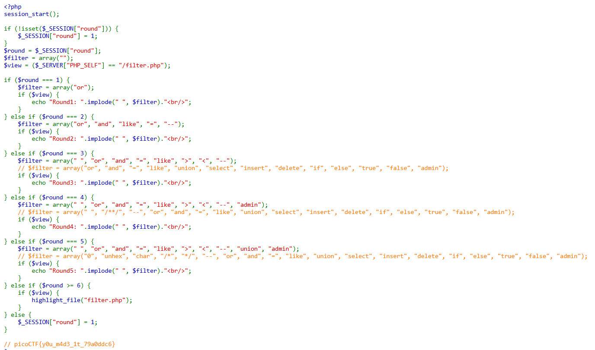
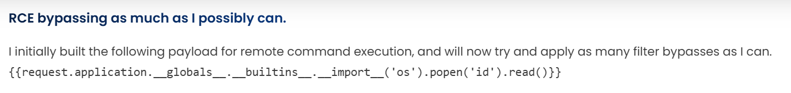
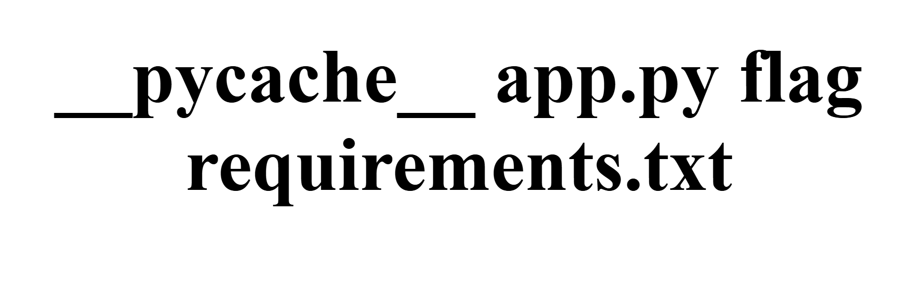
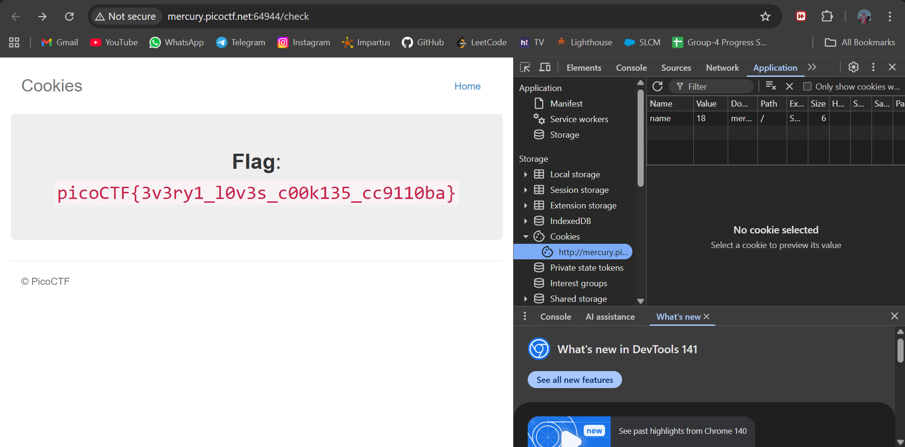

# 1. Web Gauntlet

Can you beat the filters?
Log in as admin http://shape-facility.picoctf.net:49423/  http://shape-facility.picoctf.net:49423/filter.php

## Solution:

I first tried to look for clues to understand that this challenge is about SQL injections. I tried a few trial and errors to understand that the filter.php url gives the certain commands that I cannot use in my SQL injections. So I brute forced a bit, trying out multiple SQL injection methods from a cheatsheet available online till I finished round 5 to get the source code of the website and the flag at the bottom



## Flag:

```
picoCTF{y0u_m4d3_1t_79a0ddc6}
```

## Concepts learnt:

- How to use SQL injections and how they work.

## Notes:

- None

## Resources:

- [SQL injections cheatsheet 1](https://github.com/payloadbox/sql-injection-payload-list)
- [SQL injections cheatsheet 2](https://portswigger.net/web-security/sql-injection/cheat-sheet)


# 2. SSTI1

I made a cool website where you can announce whatever you want! Try it out!
I heard templating is a cool and modular way to build web apps! Check out my website here!

## Solution:


I first researched on the SSTI topic and found an SSTI bypassing command which can be used to bypass the templating and instead run linux commands with the announce bar to be the interface, so when I used few of the standard bypassing commands, I came across one as shown in the picture, so when I ran that, it displayed the uid, gid, etc. Therefore pointing to the fact that the ones inside the second quotations are the commands that will be run by linux system, so first I used ls to "announce" its contents.


After finding this, I then used the "cat flag" command in the same terminal before to print the flag out.

## Flag:

```
picoCTF{s4rv3r_s1d3_t3mp14t3_1nj3ct10n5_4r3_c001_9451989d}
```

## Concepts learnt:

- How to bypass input templates using SSTI and how does SSTI work. 

## Notes:

- SSTI occurs when a server renders a user input as a template.

## Resources:

- [SSTI help and commands](https://onsecurity.io/article/server-side-template-injection-with-jinja2/)


# 3. Cookies

Who doesn't love cookies? Try to figure out the best one. http://mercury.picoctf.net:64944/

## Solution:

First I loaded up the website and then used the inspect tool, now since the challenge name itself is hinting towards cookies, I changed the tab to "application" and opened the website cookies, Now as the search bar hinted to search "snickerdoodle", I noticed the value number go from -1 to 0, this gave me a hint that changing the value numbers might help me, so I went changing the values until I hit 18 where it printed out the flag.  

## Flag:

```
picoCTF{3v3ry1_l0v3s_c00k135_cc9110ba}
```

## Concepts learnt:

- How to use the cookies and manipulate them to get what is desired.

## Notes:

- Very similar to a citadel challenge I solved.

## Resources:

- None

